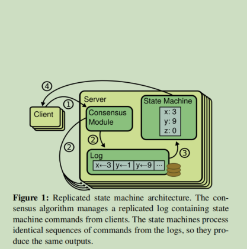
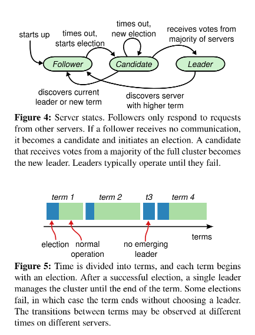
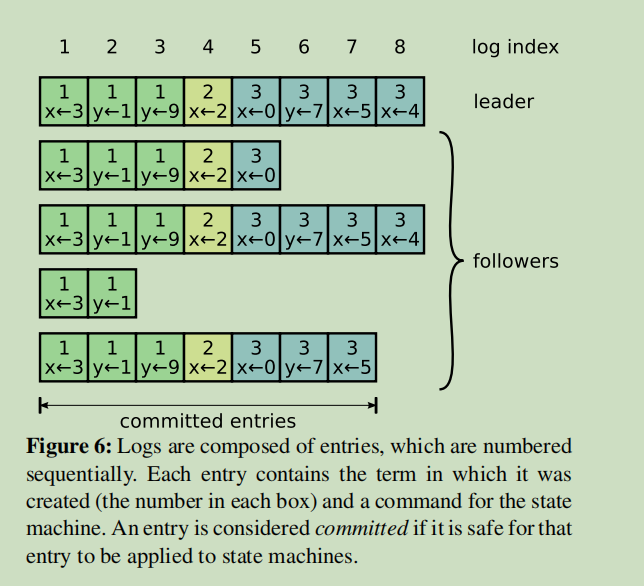

# raft共识算法的认识与实现

## 阅读相关文档

- 阅读raft论文

  <!-- 
 -->
  
raft论文总结

  <text>

    # 可理解的一致性算法研究

    ## 摘要

    - raft比paxos更容易理解,在构建大型系统的时候方便实现

    ## 1 介绍

    1. 什么叫一致性算法，一致性算法就是协调多台机器有序工作，允许成员失败
    2. 天下苦paxos久矣，需要个更简单理解和实现的一致性算法，方便程序员理解什么是一致性算法
    3. raft将问题分解，减少raft不确定性，在实际的教学当中，raft要比paxos容易理解
    4. raft与Oki，VSR很像，但有如下新特性
        - 强leader ： 日志只从领导流向follower
        - leader选举 ： raft使用随机定时器来选举领导人。
        - 成员变更 ： raft使用了一种新的`联合共识`的方法，多数两种不同的配置在转换过程中重叠在一起
    5. 使劲吹raft多么多么牛逼，算法性能与其他一致性算法差不多，本文的其余部分介绍了复制的状态机问题（第2节），讨论了Paxos的优点和缺点（第3节），描述了我们对可理解性的一般方法（第4节），提出了Raft共识算法（第5-8节），评估了Paxos，Raft共识算法（第5-8节），评估了Raft（第9节），并讨论了相关工作（第10节）。

    ## 2. 复制状态机

    1. 共识通常出现在状态机背景下，冗余状态机通常被用来解决分布式系统中的容错问题，例如，诸如GFS [8], HDFS [38],和RAM云[33]通常使用一个状态机管理leader选举，存储相关重要的配置信息复制状态机的例子包括Chubby[2] 和 ZooKeeper [11]
    
        

    2. 因为两台状态机按顺序执行相同的`日志`x=1.y=3等等,那么这两个状态机计算的状态和输出的结果也是一样的，所以共识算法要保证日志的一致性是非常重要的工作。即使一些状态机因为机械故障导致宕机(少于raft规定的数量)，但是这些服务器看起来还是像一个整体一样对外提供服务。
        - 它们确保在所有非拜占庭条件下的安全性（永远不会返回错误的结果），包括网络延迟、分区、以及数据包丢失、重复和重新排序
        - 只要有任何一台服务器在运行，它们就能完全发挥可用作用。大部分的服务器都在运行，并能与其他服务器和客户进行通信。彼此之间以及与客户端之间进行通信。因此，一个典型的由五台服务器组成的集群可以容忍任何两台服务器的故障,假设服务器的故障是通过停止；它们后来可能从稳定的存储中恢复状态并重新加入集群。
        - 它们并不依赖时间来确保日志的一致性：时钟故障和极端的消息延迟在最坏的情况下会导致可用性问题。延迟，在最坏的情况下，会导致可用性问题。
        -  在通常情况下，只要集群中的大多数follower响应了命令，命令就以完成。一旦集群中的大多数follower对单轮RPC作出反应，一个命令就已经完成。少数缓慢的服务器不影响整个系统的性能。

    总结 : 第二节主要是引入状态机的太粘，并给出raft与状态机交互的大致流程
    ## 3 Paxos怎么了？

    1. Leslie Lamport创造了paxos共识算法，paxos被证明是安全的(能够达到一致)，有效的。但是paxos有两个明显的缺点(ps:什么是多paxos,single-decree子集)
        - paxos非常难以理解，专业人士也很难理解全面，Paxos的不透明性来自于它选择了(单法令)子集作为其基础
        - 构建实际系统时候也很难去实现，并验证，，Paxos使用的是对称的对等方法为核心（尽管它最终建议采用一种弱的领导形式作为性能优化）。这在简化问题上是有意义的.但很少有实际的系统使用这种方法

    2. 构建一个paxos为基础的分布式系统很难，理解paxos算法也很难(ps:下面引用来自于Chubby系统的总结)。所以作者认为paxos没有为构建一个分布式系统提供一个很好的基础，所以作者提出了新的一致性算法 -- 容易理解，对构建大型分布式系统也有帮助。在设计raft算法的时候，作者使用问题分解方法，将问题分解为，选举，日志复制，安全和成员变更等主要子问题。
        > Paxos算法的描述与现实世界的需求之间存在着巨大的差距。最终的系统将基于一个未经证实的协议[4]。
    3. 第二个简化的地方是简化了状态空间，使系统连贯，作者努力消除不确定性，日志不允许有洞，并且Raft限制了日志可能变得彼此不一致的方式，但在某些情况下，不确定性实际上提高了可理解性。特别是，随机化方法引入了不确定性，但它们倾向于通过处理所有可能的选择来减少状态的空间，以一种类似的方式处理所有可能的选择 ("选择什么,这并不重要")。我们使用随机化来简化Raft领袖选举算法

    总结 : 第三节只是阐述了paxos的`问题`,比如难理解，很难实现在构建大型系统的。

    ## 4. 设计的可理解性
    1. 在设计raft之初就设置了如下目标
        - 提供正确的理论基础，方便理解
        - 减少开发时间，并易于扩展
        - 在斟酌备选方案时，主要是从可理解性，会不会raft(状态空间，系统)变得复杂，但是这种分析是很主观的(想想作者与我们的硬实力差距)，所以作者选择了两种研究方式。
            - 问题分解，将共识分解为独立的子问题，分别为选举，日志复制，安全和成员变成。
            - 减少状态空间(只有leader,candidate,follower,以及优化提到的prevote/vote/appendentry),不允许日志有漏洞(index1和3之间是空的日志)，raft通过冲突检测来矫正不一致情况。随机化的方法引入了非确定性，但它们倾向于通过处理所有可能的选择来减少状态的空间，以一种类似的方式处理所有可能的选择 ("选择什么；这并不重要")。我们使用随机化 来简化Raft领袖选举算法

    ## 5. raft一致性算法

    1. leader接受来自客户端的日志条目，将其复制到其他服务器上，并告诉服务器何时可以将日志条目应用到他们的状态机上。有一个领导者可以简化对复制日志的管理。例如只允许数据从领导者流向其他服务器。一个领导者可能失败或与其他服务器断开连接，在这种情况下 选举一个新的领导者

    
    考虑到领导者的方法，Raft将共识问题分解为三个相对独立的子问题，这将在后面的小节中讨论。
    - leader选举 : 现任领导人失败,必须选择新的领导人
    - Log replication : 领导者必须接受日志条目从client,并在整个集群中复制它们。迫使其他日志与自己的日志一致（第5.3节）。
    - Safety : Raft的关键安全属性是图中的状态机安全属性。图3中的状态机安全属性：如果任何服务器 在其状态机上应用了一个特定的日志条目。 那么其他服务器就不能对相同的日志索引应用不同的命令 对相同的日志索引应用不同的命令。第5.4节描述了如何Raft如何确保这一特性；该解决方案涉及到一个 第5.2节中描述的选举机制的额外限制。

    
    
    - Election Safety: 一届任期内最多可以选出一位领导人
    - Leader Append-Only : 领导者从不覆盖或删除其日志中的的条目；它只添加新的条目
    - Log Matching : 如果两个日志包含一个具有相同的索引和术语，那么这两份日志的所有条目都是相同的。直到给定的索引为止
    - Leader Completeness : 如果在一个给定的term中提交了一个日志条目，那么该日志将出现在所有更高编号的术语的领导人的日志中。
    - State Machine Safety : 如果一个服务器在它的状态机上应用了一个日志条目 在它的状态机中应用了一个给定的索引，那么其他服务器将永远不会在同一索引应用不同的日志条目.
    Raft保证这些属性中的每一个都是真的,在任何时候都是真实的。节号表示每个属性的讨论位置。

    

    总结
    1. 所有节点都需要持久化的参数
        - `currentTerm`持久化参数，第一次初始化为0然后单调递增
        - `voteFor`当前term记录投票的candidateId
        - `commitIndex`记录当前节点可以提交的日志index
        - `lastApplied`记录当前节点可以提交给上层状态机的index
        - `nextIndex[]`当leader被选出时需要初始化的参数，且是leader最新log+1的位置
        - `matchIndex[]`初始化为0，表示leader与follower匹配的日志位置
    2. reqeustVote RPC细节
        1. requestVote的请求参数
            - `term`请求的term
            - `candidateId`
            - `lastLogIndex`candidate最新的log
            - `lastLogTerm`candidate最新的term
        2. reqeustVote response参数
            - `term`投票时候的term
            - `voteGranted`布尔类型，true说明follower同意投票
        3. 重要交互逻辑
            - 如果rpc的term小于follower的current term，follower拒绝投票
            - 如果voteFor是空或者为candaditeID,并且candaidate的log至少与follower是一样，也可以比Follower多，新
    3. AppendEntry RPC细节
        1. AppendEntry请求参数
            - `term`post RPC时的term
            - `leaderID`
            - `preLogIndex`leader进行一致性检测日志的index
            - `preLogTerm`leader进行一致性检测时日志的term
            - `entries`搬运的日志
            - `leaderCommit`leader的commitIndex
        2. AppendEntry的response参数
            - `term`RPC的当前term
            - `success`布尔类型返回true说明preLogIndex和preLogTerm是匹配的
        3. AppendEntry RPC的实现
            - rpc's term小于follower's的term则返回false
            - 如果preLogIndex，preLogTerm不匹配返回false
            - preLogIndex匹配但是preLogTerm不匹配则删掉后面所有的存在的log
            - append新log
            - leaderCommit大于follower的commitIndex时候要把follower的commitIndex设置为min(leaderCommit,len(logs))
    4. 提交给状态机的规则
        1. 如果follower节点的commitIndex大于lastApplied 那么就可以将log提交给状态机
        2. 如果发现有大的term,那么一定要更新RPC中term参数,RPC term  > currentTerm,然后candidate或者leader转变为follower
        3. Follower收不到心跳就进行选举
        4. Follower负责响应candidate和leader,言外之意就是处理requestVote RPC和AppendEntry RPC
        5. Candadite会增加自己的term,给自己投票，重置选举超时时间，发送requestVote RPC,得到多数投票就变成leader
        6. Candidate收到其他的AppendEntry的RPC就变成follower
        7. Candidate在选举超时时间内没有完成选举就重新再来一轮
        8. Leader在位时会不间断的发送心跳抑制Follower选举
        9. Leader接收来自client的命令，然后走共识层进行
        10. Leader的logIndex大于nextIndex就开始进行发送AppendEntry的RPC,如果匹配成功就更新Leader的matchIndex和nextIndex,如果没成功就增加nextIndex然后重试
        11. 如果存在一个整数N>commitIndex,然后大部分matchIndex[i]>=N，那么log[N]==currentTerm，然后将Leader设置commitIndex=N

    ## 5.1 raft基础

    1. 五台服务器是一个典型的最小集群，它最多允许两台服务器宕机，并且每台服务器有三种状态分别是`leader`,`candidate`,`follower`,follower是被动的不发送任何的请求(RPC),只是简单的回应leader和candidate的请求，如果follower接收到来自client的请求，也要路由给leader。Figure 4描述了三种状态的转换关系和条件
    2. raft主要将时间定义为任意长度的term,是连续且单调递增的,在某些情况下,会出现多个candidate同时竞选leader的情况，这时候或会出现`瓜分投票`的情况，这是整个raft系统就无法继续前进，通过引入随机选举超时解决这个问题，如果一个follower没有在选举超时实践之内接收到leader的heartbeat就会开始选举
    3. 不同的服务器可能在不同的时间观察到term之间的转换。而在某些情况下，一个服务器
    可能观察不到一次选举，甚至是整个任期(candidate在一个term时间内无法完成选举)，term在Raft中充当逻辑时钟[14]，它们允许服务器检测过时的信息，如过时的leader。每个服务器存储一个当前的currentTerm，该currentTerm随着时间的推移单调地随时间增加。每当服务器进行通信时，就会交换currentTerm。如果一个服务器的currentTerm小于另一个服务器的currentTerm，那么它就会更新自己的currentTerm，那么它就将其currentTerm更新为较大的值。如果一个candidate或leader发现它的currenTerm已经过时，它就会变成follower。如果follower收到一个过时的term的请求，它将拒绝该请求。
    

    ## 5.2  Leader election

    1. Raft使用心跳机制来触发领导者选举。当服务器启动时，它们开始作为跟随者。A 服务器只要收到有效的RPC从leader或者候选人,领导者定期发送 心跳（AppendEntries RPCs，不携带任何日志条目）。到所有追随者，以维持他们的权威。 如果一个 跟随者在一段时间内没有收到通信，称为选举超时。称为选举超时，那么它就认为没有可行的领导者，并开始选举，想成为一个新的领导者。

    2. 在开始选举，candidate递增其当前term并过渡到候选状态。然后,它为自己投票 并向集群中的每个服务器发出RequestVote RPCs。candidate继续处于 这个状态，直到发生以下三种情况之一: (a) 它赢得选举. (b) 另一个服务器确立了自己的领导地位，或者 (c) 一段时间内没有赢家。这些结果将在下面的段落中分别讨论

    3. 如果一个候选人在选举中获得了来自整个集群中大多数服务器的投票，那么它就赢得了的大多数服务器的投票选举。每台服务器在给定的任期内最多只能为一名候选人投票。以先来后到为原则（注意:第[5.4安全性](#54-安全性) 节对投票增加了一个额外的限制）。多数规则确保最多只有一名candidate能在某届选举中获胜（选举）。一旦一个candidate在选举中获胜，他就成为leader。然后它将心跳信息发送给所有的其他服务器，以建立其权威并防止新的选举。

    4. 在等待投票的过程中，候选人可能会收到一个来自另一个leader的AppendEntries RPC，该RPC来自另一服务器，声称自己是leader。如果leader的任期(包括在其RPC中)至少是与Candidate的当前任期一样大,那么candidate承认该leader是合法的，并返回到Follower状态。如果RPC中的term小于candidate的term,那么Candidate就拒绝RPC(被拒绝的RPC变成follower)，继续处于候选状态。

    5. 第三个可能的结果是，一个candidate既没有赢得选举，也没有失去选举：如果许多Follower同时成为候选人，选票可能被分割，因此没有候选人获得多数。当这种情况发生时，每个candidate都会超时，并通过增加其任期和启动新一轮的RequestVote RPC来开始新的选举。然而，如果没有额外的措施，分裂的投票 可以无限期地重复.(使用随即超时时间来解决follower同时变成candidate,也防止了candidate同时请求投票投票窘境)

    6. Raft使用随机的选举超时来确保分歧票的情况很少出现，而且能迅速解决。为了从一开始就防止分裂投票，从一个固定的时间间隔中随机选择选举超时（例如，150-300ms）。因此在大多数情况下,在分散服务器中，只有一个服务器会超时。它赢得了选举，并在其他服务器超时之前发送了在其他服务器超时前发送心跳。同样的机制被用来处理`分裂的投票`。每个candidate在选举开始时重新启动其随机的`选举超时`。并等待该超时过后再开始下一次选举。这减少了在新的选举中出现新的选举再次出现分裂票的可能性。第9.3节显示这种方法可以迅速选出一个领导者

    7. 选举是一个例子，说明可理解性如何指导我们对设计方案的选择。最初我们计划使用一个排名系统:每个candidate被分配一个独特的排名，用来在竞争的candidate之间进行选择。如果一个candidate发现了另一个排名更高的candidate，它就会回到follower的状态，这样排名更高的候选人就能更容易地赢得下一次选举。我们发现，这种方法在可用性方面产生了一些微妙的问题(一个排名较低的服务器可能需要超时，并成为一个新的服务器）。如果一个排名较高的服务器失败了，一个排名较低的服务器可能需要超时并再次成为候选人，但如果它过早地这样做，它可能会重置选举领导者的进展)。我们对算法进行了多次调整，但每次调整后都会出现新的corner cases。最终我们得出结论，随机重试的方法更加明显和容易理解。

    ## 5.3 Log replication

    1. 一旦一个领导者被选出，它就开始为客户端请求。每个客户请求都包含一个命令，由复制的状态机执行。leader将该命令作为一个新条目附加到它的日志中，然后向其他每个服务器并行地发出AppendEntries RPCs来复制该条目。当该条目已经被安全复制后（如下所述），leader将该条目应用于其状态机并返回，并将执行的结果返回给客户端。如果跟随者崩溃或运行缓慢。或者网络数据包丢失，领导者会无限期地重试AppendEntries RPCs甚至在它已经响应了直到所有跟随者最终存储了所有的日志条目。

    2. 日志的组织方式如图figure 6所示。每个日志条目都存储了一条状态机命令，以及领导者收到该条目时的term编号。日志条目中的term被用来检测日志之间的不一致，并确保图figure 3中的一些属性。每个日志条目也有一个整数索引，用来识别它在日志中的位置

    3. leader决定何时将日志条目应用于状态机是安全的；这样的条目被称为`commited`。Raft保证所提交的logEntry是持久的并且最终会被所有可用的状态机执行。一旦创建日志条目的leader创建该条目的领导者将其复制到大多数的服务器上(例如，图6中的第7条)，包括之前leader创建的logEntry包括由以前的领导者创建的条目。第[5.4节](#54-安全性)它还表明，这种`commited`的定义是安全。领导者跟踪它所知道的最高`commited`的最高索引，并将该索引包括在未来的 AppendEntries RPCs（包括心跳）中，以便其他服务器最终发现。其他服务器最终会发现。一旦一个跟随者知道 一旦跟随者得知一个日志条目被提交，它就会将该条目应用到其本地状态机（按日志顺序).

    4. 我们设计的Raft日志机制在不同服务器上的日志之间保持高度的一致性。这不仅简化了系统的行为，使其更具可预测性，而且是确保安全的重要组成部分。Raft维护以下属性，它们共同构成了日志匹配属性在figure 3中.
    
    - 如果不同服务器日志中的两个条目具有相同的索引和term，那么它们存储的是同一个命令。
    - 如果不同服务器日志中的两个条目具有相同的索引和term，那么这些日志在所有前面的条目相同。
    
    5. 第一个属性：一个leader在一个给定的term中最多创建一个具有给定日志索引的logEntry，而logEntry永远不会改变它们在日志中的位置。第二个属性由AppendEntries执行的简单一致性检查来保证。当发送一个AppendEntries RPC时，leader在其日志中包括条目的索引以及紧接在其日志中的条目的索引和term。如果follower在其日志中没有找到具有相同索引和术语的条目它的日志中没有找到具有相同索引和term的条目，那么它就会拒绝这些logEntry。一致性检查充当了一个归纳步骤：日志的初始空状态满足了日志的匹配属性，而一致性检查则保留了只要日志被扩展，一致性检查就会保留日志匹配属性。因此，只要AppendEntries成功返回。领导者知道跟随者的logEntry与它的自己的logEntry相同的,直到新的条目。
    
    6. 在正常运行期间，领导者和跟随者的日志保持一致，因此AppendEntries一致性检查不会失败。然而，leader崩溃会使日志不一致（老leader可能没有完全复制其日志中的所有条目）。这些不一致会在一系列的领导者和追随者崩溃中加剧。figure 7说明了追随者的日志可能与新领导者的日志不同的方式。跟随者可能会缺少领导者的条目，可能会有领导者没有的额外条目，或者两者都有。日志中缺失和多余的条目可能跨越多个term。

    7. 在Raft中，领导者通过强迫跟随者重复自己的日志来处理不一致的问题。跟随者的日志与自己的日志重复。这意味着 跟随者日志中的冲突条目将被领导者日志中的条目覆盖。第5.4节将表明这就是安全的 如果再加上一个限制。

    8. 为了使追随者的日志与自己的日志保持一致，领导者必须找到两个日志一致的最新日志条目，删除追随者日志中此后的所有条目，并向追随者发送此后领导者的所有条目。所有这些动作都是为了响应AppendEntries RPCs所进行的一致性检查而发生的。leader为每个follower维护一个nextIndex，它是领导将发送给该跟随者的下一个日志条目的索引。当一个领导者第一次上台时。它将所有的`nextIndex`值初始化为其日志中最后一条的索引（feature 7中的11）。如果跟随者的日志与领导者的日志不一致，在下一个AppendEntries RPC中，AppendEntries一致性检查将失败。在拒绝之后，领导者会减少`nextIndex`并重试 AppendEntries RPC。最终，`nextIndex`将达到 一个领导者和追随者日志匹配的点。当这种情况发生时，AppendEntries就会成功，这就删除了移除跟随者日志中任何冲突的条目，并从领导者日志中添加 从领导者的日志中添加条目（如果有的话）。一旦AppendEntries 成功后，跟随者的日志就与领导者的一致了。并且在余下的时间里保持这种状态。

    9. 如果需要，该协议可以被优化以减少被拒绝的AppendEntries RPC的数量。例如，当拒绝一个AppendEntries请求时，跟随者包括冲突条目的term和它为该term存储的第一个索引。有了这些信息，领导者可以递减 `nextIndex`以绕过该term中的所有冲突条目；每个有冲突条目的term将需要一个AppendEntries RPC而不是每个logEntry的RPC。在实践中，我们怀疑这种优化是否有必要，因为故障发生的频率很低而且不太可能有很多不一致的条目。
    10. 有了这种机制，领导者不需要采取任何特别的行动来恢复日志的一致性。它只是开始正常运行，而日志会自动收敛，以应Append-Entries一致性检查的失败。一个领导者从不覆盖或删除自己日志中的条目（figure 3中的 仅领导者append logEntry属性）。

    11. 这种日志复制机制表现出了第2节中所描述的理想的共识属性：只要大多数服务器都在运行，Raft就可以接受、复制和应用新的日志条目；在正常情况下，一个新条目可以通过单轮RPCs复制到集群的大部分；而且一个缓慢的跟随者也不会影响性能。

    ## 5.4 安全性

    目前来说已经说明raft是如何选举和复制日志的，但是这并不能保证不同的状态机执行不同的log，还是会因为follower进入不可用状态然后恢复活性并竞选为leader，这时候leader的日志就会不一致

    ### 5.4.1 选举限制
    VSR算法一开始日志不全的情况下成为leader，然后当某台服务器成为leader之后会额外的同步这些未同步的日志，而raft则会检查candidate和follower的日志，因为如果集群保证半数node提交日志，那么就会有半数服务器是拥有最新的日志的，两份日志，任期号大的比较新，任期号相同，索引大的比较新

    ### 5.4.2 提交之前任期内的日志条目

    熟读figure 8 的图，为了消除figure 8的情况，raft不会通过计算副本数量来提交日志，只有当前任期的日志会通过计算副本数量来进行提交日志，而raft使用了一种更加保守办法，为每个logEntry都保留任期号，想提交之前日志，leader必须使用当前任期号，与其他算法相比，raft只需要发送更少的日志条目

  </text>

  <!-- 
 -->

- Students' Guide to Raft

    <!-- 
 -->
    
Students' Guide to Raf文档

    
    <text>

    > https://thesquareplanet.com/blog/students-guide-to-raft/ 原文链接

    在过去几个月里，我成为了MIT6.824的一名助教.以往这门课程的实验都是基于paxos实现一致性算法,然后今年(2016),我们决定使用raft,raft的设计理念是"理解门槛低"，并且我们也希望这项决定使同学们的生活更简单[在过去的几个月里，我一直是麻省理工学院6.824分布式系统课的教学助理。这门课传统上有一些建立在Paxos共识算法上的实验，但今年，我们决定改用Raft。Raft是 "设计成易于理解的"，我们希望这一改变能使学生的生活更轻松]

    这篇实验指南,对应着"教师教学指南"，印证着我们实验室与raft的journey，也希望对学生更好的理解raft内部运行机制，实现raft分布式协议起到帮助,如果你正在寻找Raft和Paxos的对比，或者raft的教学(pedagogical)分析,请前去阅读《教师教学指南》.文章底部包含一些学生提问的关于raft的共性问题的问题列表。如果你遇到的问题不在那些问题之内，请前去检查Q&A系统，这篇文章非常的长,但是它提出的所有点，都是现实中学生(助教)碰到过的问题，这是一篇值得阅读的文章。

    ## 背景

    
    开始深入研究raft之前,一些前情提要或许是有用的，6.824过去有一些基于用golang实现的Paxos实验，之所以选择go是因为它易于理解和学习的，它非常适合实现高并发，分布式应用(goroutine是特别便利的)，通过这门课程的四门实验课程，学生构建一个容错的，共享key-value存储系统，第一个实验让你构建一个基于log的一致性算法库,第二门实验在一致性算法库智商添加了key-value的存储，第三们实验课是实验构建共享的key-value容错集群,使用共享master节点解决集群成员变更，同时第四们实验,学生不得不实现失败和恢复机制，包括磁盘完整和磁盘不完整的情况这个实现曾作为学生默认的最后实验

    这些年我们决定使用raft重写所有mit6.824的实验，前三个实验跟以前是相同的,但是删除了第四个已经在raft中实现了关于失败与持久化的实验,这篇文章主要讨论了我们第一个实验的经验，一个直接跟raft相关的的实验，虽然我们也会接触到构建raft之上的应用层,(第二门实验)。

    如果想了解raft的简单的运行逻辑，这个[web site](https://raft.github.io/)网站演示的raft协议是最好的文字材料.

    raft是一种被设计为容易理解的一致性算法,在容错,性能方面等价于paxos算法,他们的不同点是raft将问题解耦为相对独立的问题,它也在实际的系统中清晰的解决了很多实际问题.我们也希望跟多的读者实现raft,以及构建更多的基于raft一致性系统

    这个网站的可视化raft协议提供了很好的主要组件的概括,论文提供了更直观的说明为什么需要这些组件,如果你还没有阅读raft extend 论文,请有限阅读那篇论文然后再阅读这份<<raft指南>>,由于我假设你对raft有了个大致的了解(ps:这段要翻译成"你对raft有一定程度的熟悉").

    正如其他的分布式一致性协议一样,协议细节有很多的"坑",在稳定的状态下,没有节点失效,raft协议就很好理解,可以很直观的理解,可以从上面的可视化网站了解其运行机制,假设没有节点失效,一个leader会最终被选出来,客户端所有发给raft的请求都会最终发送给follower,但是当网络出现通信延迟,网络分区,节点宕机等等假设发生,但是在特定情况下,我们看到有很多bugs一次次的重复出现,由于直接的错误理解和疏忽,当阅读论文的时候,这不是raft独有的,而是所有提出正确复杂分布式系统都存在的问题

    ## 实现raft

    raft论文的figure2是最好的guide，figure2指定每个RPC的工作的方式，当你读完figure2就可以着手实现raft，但是问题也就接踵而至。实际上，figure2是极其严格的，论文中有些叙述是must而不是should，举个例子，你也会有理由重置election timer, 无论什么时候收到 Request vote and Append entry RPC,这两个RPC说明，其他的server其中一个是leader，另一个是candidate在尝试成为leader，这不允许人为干预或者推理。
    > If election timeout elapses without receiving AppendEntries RPC from current leader or granting vote to candidate: convert to candidate.

    他们之间是有很大区别的，之前的实现可能有某些特定场景下有严重的活性问题
    

    ### 重要的细节

    raft会把没有entry的appendEntry的RPC视为hearbeat,很多同学假设AppendEntry RPC是某种特殊的RPC,尤其是很多人是指简单的reset计时器，然后返回success，而不进行任何的冲突检测，接受accept就承认follower承认没有冲突，leader根据返回的response来提交logEntry,另外一个问题就是，follower根据收到冲突的prevLogIndex，就会删掉那个点的log，然后吧entries直接进行复制。
    > If an existing entry conflicts with a new one (same index but different terms), delete the existing entry and all that follow it.

    这里的if很关键。如果跟随者拥有领导者发送的所有条目，跟随者必须不截断其日志。任何跟随领导者发送的条目的元素都必须被保留。这是因为我们可能从领导者那里收到了一个过时的AppendEntries RPC，而截断日志将意味着 "收回"我们可能已经告诉领导者我们的日志中的条目。

    ## Debugging Raft

    第一版的实现肯定是问题百出,我们需要慢慢的迭代实现,问题大致有如下几点，通常有如下四种主要的bugs`活锁`，`不正确或者不完整的RPC`,`fail_follow_rule`,`term confusion`,还有`死锁`

    ### 活锁
    当你的系统活锁时，你系统中的每个节点都在做一些事情，但你的节点集体处于这样一种状态，没有任何进展。这种情况在Raft中很容易发生，尤其是当你没有虔诚地遵循图2时。有一种活锁情况特别经常出现；没有选举领导人，或者一旦选举了领导人，其他节点又开始选举，迫使最近当选的领导人立即退位。  
    
    出现这种情况的原因有很多，但有几个错误是我们看到无数学生犯的。
    - 确保你在图2说的时候准确地重置你的选举计时器。具体来说，你只应该在以下情况下重启你的选举计时器：a）你从当前的领导者那里得到一个AppendEntries RPC（即，如果AppendEntries参数中的term已经过时，你不应该重启你的计时器）；b）你正在开始一个选举；或者c）你授予另一个candidate(requestVote RPC)一个投票。最后一种情况在不可靠的网络中尤其重要，因为在这种网络中，跟随者很可能有不同的日志；在这些情况下，你最终往往只有少数服务器，而大多数服务器都愿意为其投票。如果你每当有人要求你为他投票时就重置选举计时器，这就使得一个有过时日志的服务器和一个有较长日志的服务器同样有可能站出来。事实上，由于具有足够最新的日志的服务器太少，这些服务器很不可能在正常的情况下举行选举而当选。如果按照图2的规则，拥有较多最新日志的服务器不会被过时的服务器的选举打断，因此更有可能完成选举，成为领导者。
    - 按照图2的指示，你应该何时开始选举。特别要注意的是，如果你是一个候选人（即，你目前正在进行选举），但选举计时器启动了，你应该开始另一次选举。这一点很重要，可以避免系统因RPC的延迟或放弃而停滞。
    - 在处理传入的RPC之前，请确保你遵循 "服务器规则 "中的第二条规则。第二条规则指出。
        > If RPC request or response contains term T > currentTerm: set currentTerm = T, convert to follower (§5.1)  
    
        例如，如果你已经在当前任期内投票，而传入的RequestVote RPC的任期比你高，你应该首先下台，采用他们的任期（从而重新设置 votedFor），然后处理RPC，这将导致你授予投票权
    ### 不正确的RPC
    尽管图2清楚地说明了每个RPC处理程序应该做什么，但一些细微之处仍然容易被忽略。以下是我们反复看到的一些情况，你应该在你的实现中注意这些情况.  
    - 发现不对逻辑的RPC就尽快返回false
    - 发现follower比leader日志少了，follower就返回false，然后将最新index更新给leader的nextIndex
    - leader即使没有发送entry，也要检查prevLogIndex
    - AppendEntries的最后一步（#5）中的min是必要的，它需要用最后一个新条目的索引来计算。仅仅让应用lastApplied和commitIndex之间的日志内容的函数在到达日志的末尾时停止，是不够的。这是因为你的日志中可能会有与领导者的日志不同的条目，在领导者发给你的条目之后（这些条目都与你的日志中的条目一致）。因为 #3 决定了你只在有冲突的条目时才截断你的日志，那些条目不会被删除，如果 leaderCommit 超出了领导者发给你的条目，你可能会应用不正确的条目。发送高leader commit index和空的entry的RPC就会导致apply出现问题
    - 要完全按照第5.4节中描述的方式实现 "最新日志"检查。老老实实的实现，不要只只检查长度!

    ### 没有按照论文的理论实现raft
    虽然Raft论文对如何实现每个RPC处理程序非常明确，但它也没有对一些规则和不变因素的实现进行说明。这些都列在图2右侧的 "服务器规则 "部分。虽然其中一些规则是不言自明的，但也有一些需要非常仔细地设计你的应用程序，使其不违反规则.  
    - 在任何阶段`commitIndex>lastApplied`你都可以直接`apply`log到上层状态机,提交日志的时候不持有锁或者设置数据保护区，保证其他程序不apply日志
    - 将`commitIndex>lastApplied`解耦,每次sentout心跳的时候检查`commitIndex`你必须要等`appendlog`动作完成
    - `AppendEntries`RPC并不是因为log不一致被reject,应该立刻降级为follower,不要更新`nextIndex`，如果这个时候立刻选举你可能会面对数据竞争的问题
    - `commitIndex`不能设置为旧的term，你一定要checklog[N].Term ==currentTerm.这是因为leader不知道follower是否在当前任期提交了日志,Figure 8会详细阐述这个问题

    一个常见的混淆是`nextIndex`和`matchIndex`之间的区别。特别是，你可能会观察到`matchIndex` = `nextIndex` - 1，而干脆不实现`matchIndex`。这是不安全的。虽然nextIndex和matchIndex通常在同一时间被更新为类似的值（具体来说，nextIndex = matchIndex + 1），但两者的作用完全不同。它通常是乐观的（我们分享一切），并且只在消极的反应中向后移动。例如，当一个领导者刚刚当选时，`nextIndex`被设置为日志末尾的索引指数。在某种程度上，`nextIndex`是用于性能的--你只需要将这些东西发送给这个peer。  

    `matchIndex`是用于安全的。`matchIndex`不能被设置为一个太高的值，因为这可能会导致`commitIndex`被向前移动得太远。这就是为什么`matchIndex`被初始化为-1（也就是说，我们不同意任何前缀），并且只在跟随者肯定地确认AppendEntries RPC时才更新。  

    ### term混乱(term不稳定)  
    因为网络导致的RPC过期问题，term混淆是指服务器被来自旧term的RPC所迷惑。一般来说，在收到RPC时，因为图2中的规则确切地说明了当你看到一个旧term时你应该做什么。然而，图2一般没有讨论当你收到旧的RPC回复时你应该做什么。根据经验，我们发现，到目前为止，最简单的做法是首先记录回复中的term(它可能比你当前的term高),然后将当前term与你在原始RPC中发送的term进行比较。如果两者不同，就放弃回复并返回。只有当这两个术term相同时，你才应该继续处理回复。也许你可以通过一些巧妙的协议推理在这里做进一步的优化，但这种方法似乎很有效。而不这样做会导致一条漫长而曲折的血汗、泪水和绝望的道路。  
    NOTE:A节点无论是RV还是AE的RPC,在回复中都要进行与A节点的currenTerm进行比对,如果发现不对，就立即放弃回复并返回。

    ### 优化  
    Raft论文包括几个感兴趣的可选功能。在6.824中，我们要求学生实现其中的两个：日志压缩（第7节）和加速日志回溯（第8页的左上方）。前者对于避免日志无限制地增长是必要的，而后者对于使落后的追随者快速更新是有用的。  
    这些功能不是 "核心Raft "的一部分，因此在论文中没有得到像主要共识协议那样的关注。日志压缩的内容相当全面（在图13中），但遗漏了一些设计细节，如果你太随意地阅读，可能会错过。  
    - 当快照应用程序状态时，你需要确保应用程序状态与Raft日志中某个已知索引之后的状态相对应，这意味着应用程序要么需要向Raft传达快照所对应的索引，要么Raft需要推迟应用额外的日志条目，直到快照完成。
    - 该文本没有讨论当服务器崩溃并重新启动时的恢复协议，因为现在涉及到快照。特别是，如果Raft状态和快照是分开提交的，服务器可能会在坚持快照和坚持更新的Raft状态之间崩溃。这是一个问题，因为图13中的第7步决定了快照所覆盖的Raft日志必须被丢弃。如果当服务器重新启动时，它读取的是更新的快照，而不是过时的日志，那么它最终可能会应用一些已经包含在快照中的日志条目。这种情况会发生，因为commitIndex和lastApplied没有被持久化，所以Raft不知道这些日志条目已经被应用。解决这个问题的方法是在Raft中引入一个持久化状态，记录Raft持久化日志中的第一个条目所对应的 "真实 "索引。然后，这可以与加载的快照的lastIncludedIndex进行比较，以确定在日志的头部有哪些元素需要丢弃.
    -  如果当服务器重新启动时，它读取的是更新的快照，而不是过时的日志，那么它最终可能会应用一些已经包含在快照中的日志条目。这种情况会发生，因为commitIndex和lastApplied没有被持久化，所以Raft不知道这些日志条目已经被应用。解决这个问题的方法是给Raft引入一个持久化状态，记录Raft持久化日志中的第一个条目对应的 "真实 "索引。然后，这可以与加载的快照的lastIncludedIndex进行比较，以确定要丢弃日志头部的哪些元素。  
    
    加速日志回溯的优化是非常不明确的，可能是因为作者认为这对大多数部署来说是不必要的。文本中并没有明确说明领导者应该如何使用从客户端发回的冲突索引和术语来决定使用哪一个NextIndex。我们认为作者可能希望你遵循的协议是。
    
    - 如果一个跟随者的日志中没有prevLogIndex，它应该以conflictIndex = len(log)和conflictTerm = None返回。
    - 如果一个跟随者在其日志中确实有prevLogIndex，但是术语不匹配，它应该返回conflictTerm = log[prevLogIndex].Term，然后在其日志中搜索其条目中术语等于conflictTerm的第一个索引。
    - 在收到冲突响应时，领导者应该首先搜索其日志中的conflictTerm。如果它在日志中找到一个具有该term的条目，它应该将nextIndex设置为其日志中该term的最后一个条目的索引之外的那个索引。
    - 如果它没有找到该术语的条目，它应该设置 nextIndex = conflictIndex。一个半途而废的解决方案是只使用conflictIndex（而忽略conflictTerm），这简化了实现，但这样一来，领导者有时会向跟随者发送更多的日志条目，而不是严格意义上所需要的，以使他们达到最新状态。
    ## Applications on top of Raft

    </text>
    <!-- 
 -->

## AppendIndex

- 2022/08/21
    etcd的raft模块难得不只是一点点，看来不能直接看它和etcd的整合，尝试着理解那个example开始。一个玩具的raftkv.
