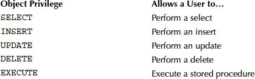
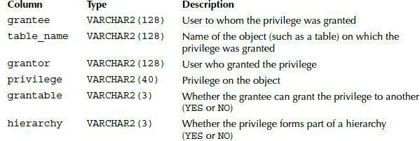
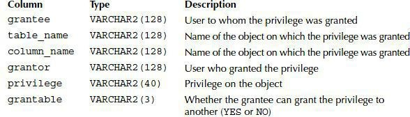
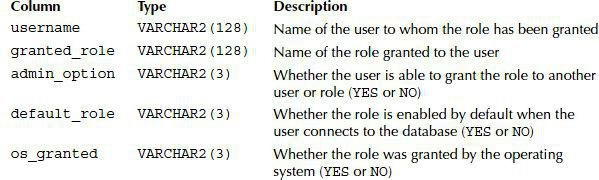
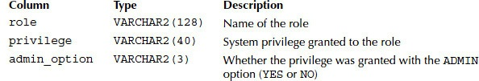

作者寄语:This book is dedicated to my family.Even though you’re far away, you are still in my heart.

About the Author: Jason Price is a freelance consultant and former product manager of Oracle Corporation. He has contributed to many of Oracle’s products

<!-- more -->

# 10 User Priviledges and Roles

- create users
- See how privileges enable users to access data and perform database tasks
- Explore the two types of privileges: system privileges and object privileges
- Learn how system privileges enable actions such as executing DDL statements
- See how object privileges enable actions such as executing DML statements
- Group privileges together into roles
- Audit the execution of SQL statements

`tablespace` Tablespaces are stored in datafiles , which are files stored in the file system of a database server. A datafile stores data for one tablespace The Oracle database software creates a datafile for a tablespace by allocating the specified amount of disk space plus the overhead for a file header ,including tables , types ,PLSQL code

## 10.1 User

### 10.1.1 Create a User
```sql
CREATE USER user_name IDENTIFIED BY password
[ DEFAULT TABLESPACE default_tablespace ]
[ TEMPOARY TABLESPACE tempoary_tablespace ];
```
`user_name` is name of database user
`password` is the password for the database user
`default_tablespace` If you omit a default tablespace, the default `SYSTEM tablespace`, which always exists in a database, is used
`tempoary_tablespace` include temporary tables If you omit a temporary tablespace, the default `SYSTEM tablespace` is used
so the example as below
```sql
CREATE USER jason IDENTIFIED by price
```
and grant user basic privileges like create session
```sql
grant create session to jason;
```
here have so many extend privileges

### 10.1.2 change password

```sql
ALTER USER jason IDENTIFIED BY marcus
---or another way
CONNECT jason/marcus PASSWORD
```

### 10.1.3 delete user

```sql
drop user jason
```

## 10.2 System privileges


for all the reference ,please refer oracle published manual

### 10.2.1 grant system privileges to a user


```sql
connect system/oracle
GRANT CREATE SEESON,CREATE USER,CREATE TABLE to steve
```
You can also use WITH ADMIN OPTION to allow a user to grant a privilege to another user.
```sql
grant execute any procedure to steve wth admin option
```
EXECUTE ANY PROCEDURE can then be granted to another user by steve .The following example connects as steve and grants EXECUTE ANY PROCEDURE to gail :
```sql
connect steve/brown
grant execute any procedure to gail
```
You can grant a privilege to all users by granting to PUBLIC
```sql
connect system/oracle
grant execute any procedure to public
```

### 10.2.2 Checking System Privileges Granted to a User

`data dictionary` stores information about the database itself.

table `user_sys_privs` stores current user privileges that it has
- `username` indicates current user,
- `privileges` indicates that user owned privileges,
- `admin_option`indicate whether the user is able to grant privileges to another user.
if steve had create user privileges , so he could create user. 
```sql
connect steve/brown
create user roy IDENTIFIED by red;
```

### 10.2.3 Revoking System Privileges from a User
you could also revoke user privileges bby below sql.
```sql
connect system/oracle
revoke create table from steve
```
if you want revoke user execute procedure
```sql
revoke execute any procedure fron steve
```

## 10.3 Object Privileges



### 10.3.1  Granting Object Privileges to a User

```sql
connect store/store_password
grant select , insert , update on store.products to steve
```
or narrow table privileges for certainly columns.
```sql
grant update (last_name,salary) on store.employees to steve
```

note: You use the GRANT option to allow a user to grant an object privilege to another user, and you use the ADMIN option to allow a user to grant a system privilege to another user.

```sql
grant select on store.customers to steve with grant option;
```

connect as steve to grant privileges to gail

```sql
connect steve/brown
grant select on store.customers to gail;
```
### 10.3.2  check object privileges made

table `user_tab_privs_mad` could get all object privileges made

```sql
select * from user_tab_privs_mad where table_name = 'products'
```
You can check which column object privileges a user has made by querying
`user_col_privs_made`


You can check which object privileges on a table a user has received by
querying the `user_tab_privs_recd` table


You can check which column object privileges a user has received by
querying `user_col_privs_recd` 


when we got corresponding privileges you can do statement by below with schema ahead of table name
```sql
DBA_SYS_PRIVS:      查询某个用户所拥有的系统权限

USER_SYS_PRIVS:     当前用户所拥有的系统权限

SESSION_PRIVS:      当前用户所拥有的全部权限

ROLE_SYS_PRIVS:     某个角色所拥有的系统权限  

注意: 要以SYS用户登陆查询这个视图,否则返回空.

ROLE_ROLE_PRIVS:    当前角色被赋予的角色

SESSION_ROLES:      当前用户被激活的角色

USER_ROLE_PRIVS:    当前用户被授予的角色

另外还有针对表的访问权限的视图:

TABLE_PRIVILEGES

ALL_TAB_PRIVS   

ROLE_TAB_PRIVS:     某个角色被赋予的相关表的权限
-----------------------------------
©著作权归作者所有：来自51CTO博客作者day_day_up_cium的原创作品，请联系作者获取转载授权，否则将追究法律责任
Oracle中用户角色权限管理
https://blog.51cto.com/lwc0329/3000521
```
## 10.3.3 creating synonyms

across schemas you want query data , then you could use synonym to connect schema.
```sql
--1. 
connect system/oracle
grant create synonym to steve
--2.
connect steve/brown
create synonym customers for store.customers
--3. login user steve
select * from customer
```

### 10.3.4 Creating Public Synonyms

You can also create a public synonym for a table. When you do this, all the users see the synonym. this is key 
```sql
connect system/oracle
grant create public synonym to store
connect store/store_possword
grant public synonym products for store.products;
-- now you can connect as steve and retrive rows from store.products
connect steve
select * from products;

```


there is another question need to be claimed,even you had created public synonym , but you still need to grant privileges. for example
```sql
-- gail can see store public synonym ,but jail do not have objects privileges on `store.products` table
connect gail
grant select to store
connect system/oracle
grant create public synonym to store
connect store/store_possword
grant public synonym products for store.products;
-- now you can connect as steve and retrive rows from store.products
connect gail
select * from products;

```
If a user has other object privileges, that user can exercise those object privileges through a synonym. For example, if **gail** had the `INSERT` object privilege on the `store.products` table, then gail would be able to add a row to `store.products` through the products synonym.

### 10.3.5 revoke object privileges

revoke `store.products` INSERT privileges
```sql
connect store/store_password
revoke insert on products from steve;
```
revoke somebody select privileges for some one of schema 
```sql
connect store/store_password
revoke select on store.customers from steve;
```

## 10.4 Roles

A role is a group of privileges that you can assign to a user or to another role.The following points summarize the benefits of roles:
- Rather than assigning privileges one at a time directly to a user, you can create a role, assign privileges to that role, and then grant that role to multiple users and roles.
- When you add or delete a privilege from a role, all users and roles assigned that role automatically receive or lose that privileg
- You can assign multiple roles to a user or role
- You can assign a password to a role.

### 10.4.1 create roles
baisc , if you want create role , also you need get right, more like below
```sql
connect system/oracle
grant create role to store
grant create user to store with admin option
--login user store

connect store/store_password
grant create role product_manager;
grant create role hr_manager;
grant create role overall_manager IDENTIFIED by manager_password;
```

### 10.4.2 grant privileges to roles

```sql
system -> role
            |
object -> role -> role

grant select ,insert,update,delete on product_types to product_manager;
grant select ,insert,update,delete on products to product_manager;
grant select ,insert,update,delete on salary_grades to hr_manager;
grant select ,insert,update,delete on employees to hr_manager;
grant create,user to hr_manager;
grant product_manager,hr_manager to overall_manager;

```

### 10.4.3 Granting Roles to a User

general procedure to create user and assign right
```sql
connect system/oracle
grant user john IDENTIFIED by brown;
grant user harry IDENTIFIED by blue;
grant create session to john;
grant create session to harry;
```
now you can use current good way 
```sql

grant hr_manager to john;
grant overall_manager to harry;
```

### 10.4.4 Checking Roles Granted to a User

table `user_role_privs` is the key



This role is password protected. Before the user can use the role, the user must enter the role password.

### 10.4.5 Checking System Privileges Granted to a Role

table `role_sys_privs` is the key 



### 10.4.6 Checking Object Privileges Granted to a Role

table `role_tab_privs` is the key


### 10.4.7 Making Use of Privileges Granted to a Role

For a non-password-protected role, the user can immediately use the privileges assigned to the role when they connect to the database
```sql
connect john/brown
select employee_id , last_name from store.amployees where salary<any ( select low_salary from store_grades order by employee_id)

```
For example, the **harry** user has the password-protected overall_manager role. Before **harry** is able to use the overall_manager role, he must enable the role and provide the role password using the `SET ROLE` command
```sql
connect harry/blue
set role overall_manager IDENTIFIED by manager_password;

```
Then, **harry** can use the privileges granted to the role. For example:

### 10.4.8 Enabling and Disabling Roles

```sql
connect system/oracle
-- disable
alter user john default role all except hr_manager;
--enable
set role hr_manager;
-- set default role
connect system/oracle
alter user john default role hr_manager;
-- set none for role
connect john/brown
set role NONE;
-- sets the role to all roles except hr_manager
set role all except hr_manager;
```
### 10.4.9 Revoking a Role and Privileges and drop a role

```sql
-- Revoking a Role
connect store/store_password
revoke overall_manager from harry;
-- revoke Privileges
connect store/store_password
revoke all on products from product_manager;
revoke all on product_types from product_manager;
-- drop role
connect store/store_password
drop role overall_manager;
drop role product_manager;
drop role hr_manager;
```

# 12.Creating Tables, Sequences, Indexes, and Views

In this chapter, you will learn how to perform the following tasks:
- Create,modify, and drop tables
- Create and use sequences, which generate a series of numbers
- Create and use indexes,which can improve the performance of queries
- Create and use views, which are predefined(adj.[计]预先定义的) queries
- Examine flashback data archives,which store row changes made over a period of time

## 12.1 Tables

purpose: In this section,you’ll learn about creating a table. You’ll see how to modify and drop a table as well as how to retrieve information about a table from the data dictionary. The data dictionary contains information about all the database items such as `tables` `sequences`, `indexes`, and so on.

### 12.1.1 Creating a Table

```sql
CREATE [GLOBALTEMPORARY] TABLE table_name (
    column_name     type [CONSTRAINT constraint_def DEFAULT default_exp]
    [, column_name  type [CONSTRAINT constraint_def DEFAULT default_exp] ...] )

    [ON COMMIT { DELETE | PRESERVE} ROWS ]
TABLESPACE tab_space;
```

- `GLOBAL TEMPORARY` specifies that the table’s rows are temporary (this type of table is known as a temporary table). The rows in a temporary table are specific to a user session, and how long the rows persist is set using the ON `COMMIT` clause.
- `table name` is the name of the table.
- `column name` is the name of a column.
- `type` is the type of a column.
- `constraint_def` is a constraint on a column.
- `ON COMMIT` controls the duration of the rows in a temporary table. `DELETE` specifies that the rows are deleted at the end of a transaction. `PRESERVE` specifies that the rows are kept until the end of a user session,at which point the rows are deleted. If you omit `ON COMMIT` for a temporary table, then the default of `DELETE` is used.
- `tab_space` is the tablespace for the table. If you omit a tablespace,then the table is stored in the user’s default tablespace.

or using another clause

```sql
CONNECT store/store_password CREATE TABLE order_status2(
    id INTEGER CONSTRAINT order_statue2_pk PRIMARY KEY,
    status VARCHAR2(10),
    last_modified DATE DEFAULT SYSDATE
) ;
```

creating a temporary table:

```sql
CREATE GLORAL TEMPORARY TABLE order_status_temp (
id INTBGER,
status VARCHAR2(10) ,
last_modified DATE DEPAULT SYSDATE
ON COMMIT PRESERVE ROWS;
```

temporary table performs the following tasks:

- Adds a row to order_status_temp
- Disconnects from the database to end the session row in `order_status_temp` to be deleted
- Reconnects as `store` account and queries order_status_temp , which shows there are no rows in this table

### 12.1.2 Getting Information on Tables

- Running a `DESCRIBE` command for the table(desc table_name)
- Querying the `user_tables` view, which forms part of the data dictionary

```text
# Some Columns in the `user_tables` View
Column              lype                Description
table_name          VARCHAR2 (128)      Name of the table.
tablespace_name     VARCHAR2(30)        Name of the tablespace in which the table isstored.A tablespace is an area used by thedatabase to store objects such as tables.
temporary           VARCHAR2(1)         Whether the table is temporary. This is set toY if temporary or N if not temporary.
```

`select * from user_tables`会查到相关用户的信息

Notice: the `order_status_temp` table is temporary, as indicated by the Y in the last column.You can retrieve information on all the tables you have access to by querying the `all_tables` view

### 12.1.3 Getting Information on Columns in Tables

You can retrieve information about the columns in a table from the `user_tab_columns` view. Table 11-2 describes some of the columns in user_tab_columns

```text
Column              Type                Description
table_name          VARCHAR2(128)       Name of the table
column_name         VARCHAR2(128)       Name of the column
data_type           VARCHAR2 (128)      Data type of the column
data_length         NUMBER              Length of the data
data _precision     NUMBER              Precision of a numeric columnif a precision was specified
data_scale          NUMBER              Scale of a numeric column
```

The following example queries `user_tab_columns` for the `products` table:

```sql
COLUMN colunn_nane FORMAT a15
COLUMN data_type FORMAT a10
SELECT column_name, data_type, data_length,data_precision,data_s FROM uaer_tab_columns WHERE table_name = 'PRODUCTs';
COLUMN_NAME     DATA_TYPE       DATA_LENGTH     DATA_PRECISION      DATA_SCALE
PRODUcTID       NUMBER          22                                  0
PRODUCT_TYPEID  NUMBER          22                                  0
NAME            VARCHAR2        30
DESCRIPTION     VARCHAR2        50
PRICE           NUMEER          22              5                   2
```
note:You can retrieve information on all the columns in tables you have access to by querying the `all_tab_columns` view

### 12.1.4 Altering a Table

You alter a table using the ALTER TABLE statement. You can use ALTER TABLE
to perform tasks such as the following:

- Adding, modifying, or dropping a column
- Adding or dropping a constraint
- Enabling or disabling a constraint

In the following sections, you’ll learn how to use `ALTER TABLE` to perform each of these tasks. You’ll also learn how to obtain information about constraints.
#### Adding a Column
The following example uses ALTER TABLE to add an `INTEGER` column named modified by to the order_status2 table:
```sql
alter table order_status2
add modified_by INTEGER
```
The next example adds a column named **initially_created** to `order_status2` :
```sql
alter table order_status2
add initially_created date default sysdate not null;
```
You can verify the addition of the new column by running a `DESCRIBE` command on `order_status2` :
```sql
describe order_status2;

```

#### Adding a Virtual Column
Oracle Database 11g introduced virtual columns. A virtual column is a column that refers only to other columns already in the table. For example,the following ALTER TABLE statement adds a virtual column named **average_salary** to the **salary_grades** table:

```sql
alter table salary_grades add (average_salary as ( (low_salary + high_salary)/2 ));
```

