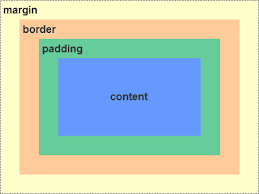

摘要：重新学下css,学完了能很快做出东西，而且是看的见东西

<!-- more -->
<!-- toc -->

# 1. 层叠，优先级和继承

## 1.1 层叠

css样式是声明式的，也存在着结构概念。这背后有很多的问题要讨论，首先我们需要理解浏览器如何解析样式规则。每条规则单独来看很简
单，但是当两条规则提供了冲突的样式时会发生什么呢？也就是说对同一个元素使用多个规则会出现冲突

```css

<!-- listing-1.2.html -->

<!doctype html>
<head>
  <style>
h1 {
  font-family: serif;
}

#page-title {
  font-family: sans-serif;
}

.title {
  font-family: monospace;
}
  </style>
</head>
<body>
  <header class="page-header">
    <h1 id="page-title" class="title">
      Wombat Coffee Roasters
    </h1>
    <nav>
      <ul id="main-nav" class="nav">
        <li><a href="/">Home</a></li>
        <li><a href="/coffees">Coffees</a></li>
        <li><a href="/brewers">Brewers</a></li>
        <li><a href="/specials" class="featured">Specials</a></li>
      </ul>
    </nav>
  </header>
</body>
```
最终ID选择器生效，层叠指的就是这一系列规则。它决定了如何解决冲突，是CSS语言的基础。
层叠的规则：
1. 样式表的来源：样式是从哪里来的，包括你的样式和浏览器默认样式等.
   1. 使用优先级更高的声明，作者样式大于默认样式
2. 选择器优先级：哪些选择器比另一些选择器更重要.
   1. 使用更高优先级的声明,是不是内联样式，使用内联样式
3. 源码顺序：样式在样式表里的声明顺序.

**术语解释**
描述问题时候尽量加上html属性和css属性，避免混淆
选择器和生命块组成了一个规则集
```css
body {
    color: back;
    font-family: Helvetica;
}
```


### 1.1.1 样式表的来源

1. 程序员编写的样式表属于作者样式表，可以覆盖浏览器默认样式
2. 用户代理样式表=浏览器默认样式，用户代理样式表优先级低
正如上面[示例代码1.2](https://github.com/kirk-zhang58/CSS-In-Depth/blob/main/ch01/listing-1.2.html)所示，这个css主要是修饰`h1`元素的，然后css代码listing-1.2.html中作者样式覆盖了原先的默认样式

!important声明,标记了!important的声明会被当作更高优先级的来源,它的优先级大于作者样式优先级


### 1.1.2 理解优先级

如果无法用来源解决冲突声明，浏览器会尝试检查它们的优先级。
1. 行内样式
   实际上行内元素属于“带作用域的”声明，它会覆盖任何来自样式表或者 < style > 标签的样式。行内样式没有选择器，因为它们直接作用于所在的元素。**为了在样式表里覆盖行内声明**，需要为声明添加!important，这样能将它提升到一个更高优先级的来源。但如果行内样式也被标记为!important，就无法覆盖它了。最好是只在样式表内用!important。将以上修改撤销，我们来看看更好的方式。!important作用更像是将样式级别提升到最高

2. 选择器优先级

    如果设置相同属性，那么即使应用了两个选择器，那么ID选择器的样式会生效
   ```css
    #main-nav a {
        color: white;
        background-color: #13a4a4;  // id选择器的样式会生效
        padding: 5px;
        border-radius: 2px;
        text-decoration: none;
    }

    .featured {
        background-color: orange;   // 类选择器不生效，优先级不高
    }
   ```
   优先级的准确规则如下。
   - id选择器 > 类选择器 > 标签选择器 
   - 如果选择器的ID数量更多，则它会胜出（即它更明确）。
   - 如果ID数量一致，那么拥有最多类的选择器胜出。
   - 如果以上两次比较都一致，那么拥有最多标签名的选择器胜出。

    比如下面例子，判断哪些属性会生效
    ```css
    html body header h1 {    ←---- ❶ 4个标签
        color: blue;
    }
    body header.page-header h1 {  ←---- ❷ 3个标签和1个类
        color: orange;
    }
    .page-header .title {       ←---- ❸ 2个类
        color: green;
    }
    #page-title {           ←---- ❹ 1个ID
        color: red;
    }
    ```
    4的id选择器优先级最高，因此标题是红色，3有两个类选择器，删除4,就会展示3的样式，两个类选择器比一个类选择器更明确

    说明 伪类选择器（如:hover）和属性选择器（如[type="input"]）与一个类选择器的优先级相同。通用选择器（*）和组合器（>、+、~）对优先级没有影响。

    如果你在CSS里写了一个声明，但是没有生效，一般是因为被更高优先级的规则覆盖了。很多时候开发人员使用ID选择器，却不知道它会创建更高的优先级，之后就很难覆盖它。如果要覆盖一个ID选择器的样式，就必须要用另一个ID选择器。

3. 优先级标记

    也可以说是优先级表达式，选择器#page-header #page-title有2个ID,所以是[2.0.0],如果加上行内样式则就是[1.2.0.0]

4. 关于优先级的思考

### 1.1.3 源码顺序

[代码清单1-10](https://github.com/kirk-zhang58/CSS-In-Depth/blob/main/ch01/listing-1.10.html)

如果两个声明所影响的元素相同和优先级相同，那么源码(html的源码,不是样式源码)后出现的就会起作用

```css
a.featured {
  background-color: orange;
}
```

但是这样的写法，会出现如果其他位置也有a标签和featured的类属性，那么就会渲染到其他地方，所以要设计好html元素和选择器

[代码清单1-11](https://github.com/kirk-zhang58/CSS-In-Depth/blob/main/ch01/listing-1.11.html)

1. 链接样式和源码顺序
正如之前所说，在CSS中最好的答案通常是“这得看情况”。实现相同的
效果有很多途径。多想些实现方法，并思考每一种方法的利弊，这是很
有价值的。面对一个样式问题时，我经常分两个步骤来解决它。首先确
定哪些声明可以实现效果。其次，思考可以用哪些选择器结构，然后选
择最符合需求的那个。

[代码清单1-12](https://github.com/kirk-zhang58/CSS-In-Depth/blob/main/ch01/listing-1.12.html)

```css
<!doctype html>
<head>
  <style>
a:link {
  color: blue;
  text-decoration: none;
}

a:visited {
  color: purple;
}

a:hover {
  text-decoration: underline;
}

a:active {
  color: red;
}

h1 {
  color: #2f4f4f;
  margin-bottom: 10px;
}

.nav {
  margin-top: 10px;
  list-style: none;
  padding-left: 0;
}

.nav li {
  display: inline-block;
}

.nav a {
  color: white;
  background-color: #13a4a4;
  padding: 5px;
  border-radius: 2px;
  text-decoration: none;
}

.nav .featured {
  background-color: orange;
}
  </style>
</head>
<body>
  <header class="page-header">
    <h1 id="page-title" class="title">Wombat Coffee Roasters</h1>
    <nav>
      <ul id="main-nav" class="nav">
        <li><a href="/">Home</a></li>
        <li><a href="/coffees">Coffees</a></li>
        <li><a href="/brewers">Brewers</a></li>
        <li><a href="/specials" class="featured">Specials</a></li>
      </ul>
    </nav>
  </header>
</body>

```

书写顺序之所以很重要，是因为层叠。优先级相同时，后出现的样式会覆盖先出现的样式。如果一个元素同时处于两个或者更多状态，最后一个状态就能覆盖其他状态。如果用户将鼠标悬停在一个访问过的链接上，悬停效果会生效。如果用户在鼠标悬停时激活了链接（即点击了它），激活的样式会生效。

这个顺序的记忆口诀是“LoVe/HAte”（“爱/恨”），即link（链接）、visited（访问）、hover（悬停）、active（激活）。注意，如果将一个选择器的优先级改得跟其他的选择器不一样，这个规则就会遭到破坏，可能会带来意想不到的结果。

2. 层叠值

浏览器遵循三个步骤，即来源、优先级、源码顺序，来解析网页上每个元素的每个属性。在 CSS 中指的是多个样式规则对同一个元素的样式属性进行规定时，会发生的覆盖和继承的现象。每个样式规则都有一个权值，样式规则的权值越大，则该规则对元素的样式属性的影响越大。当多个样式规则同时作用于同一个元素时，系统会根据规则的权值进行排序，将权值大的规则应用到元素上，而权值小的规则会被忽略


### 1.1.4 两个经验法则

1. 在选择器中不要使用ID。就算只用一个ID，也会大幅提升优先级
2. 不要使用!important。它比ID更难覆盖，一旦用了它，想要覆盖原先的声明，就需要再加上一个!important，而且依然要处理优先级的问题。
3. 关于重要性的一个重要提醒当创建一个用于分发的JavaScript模块（比如NPM包）时，强烈建议尽量不要在JavaScript里使用行内样式。如果这样做了，就是在强迫使用该包的开发人员要么全盘接受包里的样式，要么给每个想修改的属性加上!important

### 1.1.5 选择器种类

|选择器|例子|例子描述|
|---|---|---|
|.class|	.intro|	选择 class="intro" 的所有元素。|
|.class1.class2|	.name1.name2|	选择 class 属性中同时有 name1 和 name2 的所有元素。|
|.class1 .class2	| .name1 .name2	| 选择作为类名 name1 元素后代的所有类名 name2 元素。|
|#id	| #firstname| 	选择 id="firstname" 的元素。|
|*	| *	 | 选择所有元素。|
|element	| p| 	选择所有 <p> 元素。|
|element.class	| p.intro	| 选择 class="intro" 的所有 <p> 元素。| 
|element,element| div, p |	选择所有 <div> 元素和所有 <p> 元素。|
|element element| div p	|选择 <div> 元素内的所有 <p> 元素。|
|element>element| div > p	|选择父元素是 <div> 的所有 <p> 元素。|
|element+element| div + p	|选择紧跟 <div> 元素的首个 <p> 元素。|
|element1~element2|	p ~ ul	|选择前面有 <p> 元素的每个 <ul> 元素。|
|[attribute]|	[target]|	选择带有 target 属性的所有元素。|
|[attribute=value]	|[target=_blank]	|选择带有 target="_blank" 属性的所有元素。|
|[attribute~=value]|	[title~=flower]|	选择 title 属性包含单词 "flower" 的所有元素。|
|[attribute|=value]|	[lang|=en]	|选择 lang 属性值以 "en" 开头的所有元素。|
|[attribute^=value]|	a[href^="https"]	|选择其 src 属性值以 "https" 开头的每个 <a> 元素。|
|[attribute$=value]|	a[href$=".pdf"]|	选择其 src 属性以 ".pdf" 结尾的所有 <a> 元素。|
|[attribute*=value]|	a[href*="w3schools"]|	选择其 href 属性值中包含 "abc" 子串的每个 <a> 元素。|
|:active|	a:active	|选择活动链接。|
|::after|	p::after	|在每个 <p> 的内容之后插入内容。|
|::before	| p::before|	在每个 <p> 的内容之前插入内容。|
|:checked	| input:checked	|选择每个被选中的 <input> 元素。|
|:default	| input:default	|选择默认的 <input> 元素。|
|:disabled|	input:disabled|	选择每个被禁用的 <input> 元素。|
|:empty	|p:empty	|选择没有子元素的每个 <p> 元素（包括文本节点）。|
|:enabled	|input:enabled	|选择每个启用的 <input> 元素。|
|:first-child	|p:first-child	|选择属于父元素的第一个子元素的每个 <p> 元素。|
|::first-letter|	p::first-letter|	选择每个 <p> 元素的首字母。|
|::first-line	|p::first-line	|选择每个 <p> 元素的首行。|
|:first-of-type|	p:first-of-type|	选择属于其父元素的首个 <p> 元素的每个 <p> 元素。|
|:focus	|input:focus	|选择获得焦点的 input 元素。|
|:fullscreen	|:fullscreen|	选择处于全屏模式的元素。|
|:hover|	a:hover|	选择鼠标指针位于其上的链接。|
|:in-range|	input:in-range|	选择其值在指定范围内的 input 元素。|
|:indeterminate|	input:indeterminate|	选择处于不确定状态的 input 元素。|
|:invalid|	input:invalid	|选择具有无效值的所有 input 元素。|
|:lang(language)|	p:lang(it)|	选择 lang 属性等于 "it"（意大利）的每个 <p> 元素。|
|:last-child	|p:last-child	|选择属于其父元素最后一个子元素每个 <p> 元素。|
|:last-of-type|	p:last-of-type|	选择属于其父元素的最后 <p> 元素的每个 <p> 元素。|
|:link	|a:link|	选择所有未访问过的链接。|
|:not(selector)	|:not(p)	|选择非 <p> 元素的每个元素。|
|:nth-child(n)|	p:nth-child(2)|	选择属于其父元素的第二个子元素的每个 <p> 元素。|
|:nth-last-child(n)|	p:nth-last-child(2)|	同上，从最后一个子元素开始计数。|
|:nth-of-type(n)	|p:nth-of-type(2)	|选择属于其父元素第二个 <p> 元素的每个 <p> 元素。|
|:nth-last-of-type(n)	|p:nth-last-of-type(2)	|同上，但是从最后一个子元素开始计数。|
|:only-of-type	|p:only-of-type	|选择属于其父元素唯一的 <p> 元素的每个 <p> 元素。|
|:only-child	|p:only-child	|选择属于其父元素的唯一子元素的每个 <p> 元素。|
|:optional|	input:optional	|选择不带 "required" 属性的 input 元素。|
|:out-of-range	|input:out-of-range	|选择值超出指定范围的 input 元素。|
|::placeholder|	input::placeholder|	选择已规定 "placeholder" 属性的 input 元素。|
|:read-only|	input:read-only	|选择已规定 "readonly" 属性的 input 元素。|
|:read-write|	input:read-write|	选择未规定 "readonly" 属性的 input 元素。|
|:required	|input:required	|选择已规定 "required" 属性的 input 元素。|
|:root	|:root|	选择文档的根元素。|
|::selection	|::selection|	选择用户已选取的元素部分。|
|:target	|#news:target|	选择当前活动的 #news 元素。|
|:valid	|input:valid|	选择带有有效值的所有 input 元素。|
|:visited	|a:visited|	选择所有已访问的链接。|

## 1.2 继承

某些元素，在我们不指定属性值（没有层叠值）时候，他就会考虑从父标签中继承。但并不是所有的标签属性都会被进程，只有些特定的。主要是跟文本相关的属性会被继承
```css
color
font
font-family
font-size
font-weight
font-variant
font-style
line-height
letter-spacing
text-align
text-indent
text-transform
white-space
word-spacing
```
list-style、list-style-type、list-style-position以及list-style-image。表格的边框属性border-collapse和border-spacing也能被继承。注意，这些属性控制的是表格的边框行为，而不是常用于指定非表格元素边框的属性

[代码1-13](https://github.com/kirk-zhang58/CSS-In-Depth/blob/main/ch01/listing-1.13.html)
在body元素上修改了字体属性，子元素如果没有修改对应元素，那么就会继承body元素中的关于字体的定义

##  1.3 特殊值

有两个特殊值可以赋给任意属性，用于控制层叠：inherit和 initial。

### 1.3.1 使用inherit

[代码1-15](https://github.com/kirk-zhang58/CSS-In-Depth/blob/main/ch01/listing-1.15.html)

通常会给页面的所有链接的字体加一个醒目的蓝色，但是有个有需求说要让页脚的链接字体跟页脚一个颜色。那么我们就可以使用继承就可以解决问题

### 1.3.2 initial关键字

每一个CSS属性都有初始（默认）值。如果将initial值赋给某个属性，那么就会有效地将其重置为默认值，这种操作相当于硬复位了该值。这么做的好处是不需要思考太多。如果想删除一个元素的边框，设置border: initial即可。如果想让一个元素恢复到默认宽度，设置width: initial即可。

正如代码1-15所以，如果不指定inherit的话，那么也就会使用后面的样式值，因为它的样式表达式值权重更高

auto不是所有属性的默认值，对很多属性来说甚至不是合法的值。比如border-width: auto和padding: auto是非法的，因此不会生效。可以花点时间研究一下这些属性的初始值，不过使用initial更简单。

## 1.4 简写属性

比如`font: italic bold 18px/1.2 "Helvetica", "Arial", sans-serif;`就指定了font-style、font-weight、font-size、font-height以及font-family
更多的还有
- background是多个背景属性的简写属性：background-color、background-image、background-size、background-repeat、background-position、background-origin、background-chip以及background-attachment。
- border是border-width、border-style以及border-color的简写属性，而这几个属性也都是简写属性。
- border-width是上、右、下、左四个边框宽度的简写属性。

简写属性会设置省略值为其初始值
```css
title {
font: 32px Helvetica, Arial, sans-serif;
}
```
代码展开来写就是
```css

h1 {
  font-weight: bold;
}

.title {
  font-style: normal;
  font-variant: normal;
  font-weight: normal;
  font-stretch: normal;
  line-height: normal;
  font-size: 32px;
  font-family: Helvetica, Arial, sans-serif;
}

```
在所有的简写属性里，font的问题最严重，因为它设置的属性值太多了。因此，要避免在<body>元素的通用样式以外使用font。当然，其他简写属性也可能会遇到一样的问题，因此要当心。

### 1.4.1 理解简写样式的顺序

简写属性会尽量包容指定的属性值的顺序。可以设置`border: 1px solid black`或者`border: black 1px solid`，两者都会生效。这是因为浏览器知道宽度、颜色、边框样式分别对应什么类型的值

1. 上、右、下、左

```css
.
nav a {
color: white;
background-color: #13a4a4;
padding: 10px 15px 0 5px; ←---- 上、右、下、左内边距
border-radius: 2px;
text-decoration: none;
}
```
这种模式下的属性值还可以缩写。如果声明结束时四个属性值还剩一个没指定，没有指定的一边会取其对边的值。指定三个值时，左边和右边都会使用第二个值。指定两个值时，上边和下边会使用第一个值。如果只指定一个值，那么四个方向都会使用这个值。因此下面的声明都是等价的。
```css
padding: 1em 2em;
padding: 1em 2em 1em;
padding: 1em 2em 1em 2em;
```
但是下面代码就是上，下，左，右
```css
padding: 1em ;
```

2. 水平、垂直

有些属性包括background-position、box-shadow、text-shadow，比如background-position: 25% 75%则先指定水平方向的右/左属性值，然后才是垂直方向的上/下属性值。
虽然看起来顺序相反的定义违背了直觉，原因却很简单：这两个值代表了一个笛卡儿网格。笛卡儿网格的测量值一般是按照 （水平，垂直）的顺序来的。比如，如图1-15所示，要给元素加上一个阴影，就要先指定 （水平）值。
```css
.nav .featured {
background-color: orange;
box-shadow: 10px 2px #6f9090; ←---- 阴影向右偏移10px，向下偏移2px
}
```
如果属性需要指定从一个点出发的两个方向的值，就想想“笛卡儿网格”。如果属性需要指定一个元素四个方向的值，就想想"时钟"。


# 2. 相对单位

em的单位难以把握，像素单位相对简单

## 2.1 相对值的好处

### 2.1.1 那些年追求的像素级完美

### 2.1.2 像素级完美的时代终结了

响应式：根据浏览器大小有不同的响应

## 2.2 em和rem

em是一种计算单位，它的单位是根据所修饰元素的字体大小进行计算。
比如[代码2-1](https://github.com/kirk-zhang58/CSS-In-Depth/blob/main/ch02/listing-2.1.html)
如上代码设置的16px，那么padding的内边距也是16px,那么如果你的字体是32px，那么内边距就会是32px.

当计算padding,heigh,width,border-radius.使用em会非常方便。这因为当元素的字体改变时就会更改em的单位。

[代码2-3](https://github.com/kirk-zhang58/CSS-In-Depth/blob/main/ch02/listing-2.3.html)

### 2.2.1 使用em定义字号

如果定义字体的的单位是em,那么那么实际上这个字体的结果是从继承的字号进行计算的。
如[代码2-5](https://github.com/kirk-zhang58/CSS-In-Depth/blob/main/ch02/listing-2.5.html)所展示的
也就是 继承父元素字号*em = 子元素像素值，那么也就是css中的em单位是子除父字号，大多数浏览器来说，默认的字号为16px。
1. em同时作用于字体和其他属性

浏览器要先计算字号，然后再计算，然后再根据这个结算后的字号值，再去计算其他值

2. 字体缩小的问题

想象这一种场景，我们说em就是一种权重，那么如果DOM中是嵌套的，然后子元素的字体大小通过继承父元素大小计算。如果em是小于0的值，就会变成子元素逐级变小。
[代码2-9](https://github.com/kirk-zhang58/CSS-In-Depth/blob/main/ch02/listing-2.9.html) 展示出用选择器优先级来覆盖我们碰到的问题。`ul ul`选择出所有的`ul`元素


### 2.2.2 使用rem设置字号

当浏览器解析HTML文档时，会在内存里将页面的所有元素表示为DOM（文档对象模型）。它是一个树结构，其中每个元素都由一个节点表示。< html >元素是顶级（根）节点。它下面是子节点，< head >和< body >。再下面是逐级嵌套的后代节点。在文档中，根节点是所有其他元素的祖先节点。根节点有一个伪类选择器`:root`，可以用来选中它自己。这等价于类型选择器`html {}`

rem是root em的缩写，rem不是相对于当前元素，还是相对根元素，不管其他元素位于网页的任何位置，都只是计算根元素的字体大小代码清单[2-10](https://github.com/kirk-zhang58/CSS-In-Depth/blob/main/ch02/listing-2.10.html)


在CSS里，设置位置通常是“看情况”。rem只是你工具包中的一种工具。掌握CSS很重要的一点是学会在适当的场景使用适当的工具。我一般会用rem设置字号，用px设置边框，用em设置其他大部分属性，尤其是内边距、外边距和圆角（不过我有时用百分比设置容器宽度）。

## 2.3停止像素思考

很很多程序员会设置html标签字体的大小。这也的确能计算子元素的相对值，但是这回有2种弊端
1. 这会写很多覆盖的代码
2. 这本质上还是像素思想，这样不利于写响应式网页


自适应布局：是指网页能够在不同大小的终端设备上自行适应显示，也就是让一个网站在不同大小的设备上显示同一样的页面，让同一个页面适应不同大小屏幕，根据屏幕的大小，自动缩放。自适应布局的几个标志：
1. 比如单终端（手机）的N主流产品
2. 当网页缩写到一定程度时，界面会出现显示不全，并且出现横向滑动条；
3. 总体框架不变，横线布局的版块太多会有所减少。

响应式布局： 就是一个网站能够兼容多个终端，可以根据屏幕的大小自动调整页面的的展示方式以及布局，我们不用为每一个终端做一个特定的版本。响应式网站的几个标志：

1. 同时适配PC + 平板 + 手机等；
2. 标签导航在接近手持终端设备时改变为经典的抽屉式导航；
3. 网站的布局会根据视口来调整模块的大小和位置；


### 2.3.1 设置一个合理的默认的字号

在写css样式代码中，不应该采用新的字号值覆盖父值的办法，这样效率非常低下，要采用相对单位来实现字体大小的调整。可设置root元素的字体值然后在其基础上进行计算。
```css
:root {
  font-size:0.875em 
}
--公式是父/子=em
```
在[代码2-14](https://github.com/kirk-zhang58/CSS-In-Depth/blob/main/ch02/listing-2.14.html)中使用了em设置边距和圆角，使用rem设置标题和字号

### 2.3.2 构建响应式面板

在构建响应式web之前需要设置响应式面板，可以根据不同媒体媒介进行设置。及@media可以指定屏幕尺寸和媒体类型。

```css
:root {

font-size: 0.75em;              （以下3行）作用到所有的屏幕，但是在大屏上会被覆盖
}
@media (min-width: 800px) {     （以下5行）仅作用到宽度800px及其以上的屏幕，覆盖之前的值
:root {
font-size: 0.875em;
}
}
@media (min-width: 1200px) {  （以下5行）仅作用到宽度1200px及其以上的屏幕，覆盖前面两个值
:root {
font-size: 1em;
}
}

```
上卖弄代码不难看出，第一个规则集在大屏幕会被覆盖，当屏幕大于800px然后第二个规则集会生效。大于1200px则第三个规则会生效
具体代码如[2-15](https://github.com/kirk-zhang58/CSS-In-Depth/blob/main/ch02/listing-2.15.html)

### 2.3.3 缩放单个组件

假如我们有个需求是对屏幕中某个组件进行缩放，那么我们可以采用覆盖值的但是正如[代码2-16](https://github.com/kirk-zhang58/CSS-In-Depth/blob/main/ch02/listing-2.16.html)所示。

采用高权重样式值覆盖的策略


## 2.4 视口的相对单位
- vh：视口高度的1/100。
- vw：视口宽度的1/100。
- vmin：视口宽、高中较小的一方的1/100（IE9中叫vm，而不是vmin）。
- vmax：视口宽、高中较大的一方的1/100（本书写作时IE和Edge均不支持vmax

[代码清单2-18](https://github.com/kirk-zhang58/CSS-In-Depth/blob/main/ch02/listing-2.18.html)

### 2.4.1 使用vw定义字号
如果给一个元素加上font-size: 2vw会发生什么？在一个1200px的桌面显示器上，计算值为24px（1200的2%）。在一个768px宽的平板上，计算值约为15px（768的2%）。这样做的好处在于元素能够在这两种大小之间平滑地过渡，这意味着不会在某个断点突然改变。当视口大小改变时，元素会逐渐过渡。

### 2.4.2 使用calc()定义字号

calc()函数内可以对两个及其以上的值进行基本运算。当要结合不同单位的值时，calc()特别实用。它支持的运算包括：加（+）、减（-）、乘（×）、除（÷）。加号和减号两边必须有空白，因此我建议大家养成在每个操作符前后都加上一个空格的习惯，比如calc(1em +10px)。代码清单2-19用calc()结合了em和vw两种单位。删除之前样式表的基础字号（以及相关的媒体查询），换成如下代码。[代码2-19](https://github.com/kirk-zhang58/CSS-In-Depth/blob/main/ch02/listing-2.19.html)，现在打开网页，慢慢缩放浏览器，字体会平滑地缩放。0.5em保证了最
小字号，1vw则确保了字体会随着视口缩放。这段代码保证基础字号从iPhone 6里的11.75px一直过渡到1200px的浏览器窗口里的20px。可以按照自己的喜好调整这个值。我们不用媒体查询就实现了大部分的响应式策略。省掉三四个硬编码的断点，网页上的内容也能根据视口流畅地缩放。

## 2.5 无单位的数值和行高

- 如果父级的line-height属性值有单位或百分比，那么子级继承的值则是换算后的一个具体的px级别的值；
- 而如果父级的line-height属性值没有单位，则子级会直接继承这个“数值”，而非计算后的具体值，此时子级的line-height会根据本身的font-size值重新计算得到新的line-height值。

每个元素使用相同的font-size，但使用不同的font-family，但渲染出来的line-height是不同的。

CSS 权威指南基本视觉格式化一章中讲到：对于行内非替换元素或者匿名文本来说， font-size 指定了它们的 content area的高度，由于inline box 是由 content area 加上上下的 half-leading构成的，那么如果元素的leading为 0，在这种情况下，font-size 指定了inline box 的高度。

英文字体有基线（baseline）和中线（meanline），这两条线之间就是所谓的`x-height`，即小写字母x的高度。基线之上的部分是上伸区域（ascent），基线之下的部分是下伸区域（descent).

## 2.6 自定义属性(即css变量)

在2015年新的css规范引入了层叠变量的自定义属性。也就是允许在css使用变量的概念。
```css
:root {
  --main-font: Helvetica, Arial, sans-serif;
}
```
这相当于定义了一个全局的，在整个网页都可以使用的变量`main-font`,如果是在根节点定义变量，那么它下面的子元素都可以使用该变量，同理如果在某一节点元素内定义变量，那么它下面的子元素才可以使用，兄弟元素和它的父元素都无法使用，然后我们可以调用`var()`函数取出定义的值。
```css
p {
font-family: var(--main-font);
color: var(--brand-color);
}
```
思考一下如果第一个值未定义，那么就可以使用备用值.
```css
p {
    font-family: var(--main-font, sans-serif);  ←---- 指定备用值为sans-serif
    color: var(--secondary-color, blue);        ←---- secondary-color变量没有定义，因此会使
}
```
如果定义的变量是个非法值就会使用属性的`默认值`

### 2.6.1 动态改变自定义属性

其实这节主要就是讲解自定义属性变量的作用域。有如下例子
```css
<!doctype html>
<head>
  <style>
    :root {
      font-size: calc(0.5em + 1vw);
      --main-bg: #fff;
      --main-color: #000;
    }

    body {
      font-family: Helvetica, Arial, sans-serif;
    }

    .dark {
      margin-top: 2em;
      padding: 1em;
      background-color: #999;
      --main-bg: #333;
      --main-color: #fff;
    }

    .panel {
      font-size: 1rem;
      padding: 1em;
      border: 1px solid #999;
      border-radius: 0.5em;
      background-color: var(--main-bg);
      color: var(--main-color);
    }

    .panel > h2 {
      margin-top: 0;
      font-size: 0.8em;
      font-weight: bold;
      text-transform: uppercase;
    }

    .panel.large {
      font-size: 1.2em;
    }
  </style>
</head>

<body>
  <div class="panel">
    <h2>Single-origin</h2>
    <div class="body">
      We have built partnerships with small farms
      around the world to hand-select beans at the
      peak of season. We then carefully roast in
      small batches to maximize their potential.
    </div>
  </div>

  <aside class="dark">
    <div class="panel">
      <h2>Single-origin</h2>
      <div class="body">
        We have built partnerships with small farms
        around the world to hand-select beans at the
        peak of season. We then carefully roast in
        small batches to maximize their potential.
      </div>
    </div>
  </aside>
</body>

```
在上面例子中定义了两个属性。第一个在根属性上定义了属性，第二个在dark元素上定义了属性。但是第二个属性会覆盖掉第一个全局的属性，根语言中属性作用域很像

### 2.6.2 使用js改变自定义属性

具体实现不需要深究，只需要知道js可以改变属性的值，从而使网页设计更灵活

### 2.6.3 探索自定义属性

自定义属性是CSS中一个全新的领域，开发人员刚刚开始探索。因为浏览器支持有限，所以还没有出现“典型”的用法。我相信假以时日，会出现各种最佳实践和新的用法。这需要你持续关注。继续使用自定义属性，看看能用它做出什么效果。值得注意的是，在不支持自定义属性的浏览器上，任何使用var()的声明都会被忽略。请尽量为这些浏览器提供回退方案。然而这种做法不是万能的，比如当用到自定义属性的动态特性时，就很难有备用方案。关注 Can I Use网站，查看最新的浏览器支持情况。


# 3 盒子模型

## 3.1 元素宽度的问题

这一节最重要的是盒子模型



[代码3-3](https://github.com/kirk-zhang58/CSS-In-Depth/blob/main/ch03/listing-3.3.html)设置的`windth=30%`为内容的宽度。在以上例子中（代码清单3-3），两列并没有并排出现，而是折行显示。虽然将两列宽度设置为70%和30%，但它们总共占据的宽度超过了可用空间的100%，侧边栏的宽度等于30%宽度加上各1.5em的左右内边距，主容器的宽度只占70%。两列宽度加起来等于100%宽度加上3em。因为放不下，所以两列便折行显示了。

### 3.1.1 避免魔术数值

替代魔术数值的一个方法是让浏览器帮忙计算。在本例中，因为加了内边距，两列的宽度总和超出了3em，所以可以使用calc()函数减去这个值，得到刚好100%的总和。比如设置侧边栏宽度为calc(30% - 3em)就能刚好并排放下两列，但是还有更好的解决办法。

### 3.1.2 调整盒子模型

默认的盒子模型的宽度的width是内容的宽度，`box-sizing: border-box`的盒子模型的width的宽度是边框和内容

### 3.1.3 全局设置border-box

```css
*,::before,::after {
box-sizing: border-box; ←---- 给页面上所有元素和伪元素设置border-box
}
```
全部元素都采用border-box属性，但是引入第三方的css代码就会导致无法影响别人的代码，故采用
```css
:root {
box-sizing: border-box; ←---- 根元素设置为border-box
}
*,
::before,
::after {
box-sizing: inherit; ←---- 告诉其他所有元素和伪元素继承其盒模型
}

.third-party-component {
box-sizing: content-box;
}
```
这样就解决了潜在影响第三方库css代码(该书后面代码都是用box-sizing:border-box)

### 3.1.4 给列之间加上间隔

实现在两个元素之间添加间距的方法有很多，
1. 简单的就是通过计算width的值，在值上trade-off,但是间隔的宽度由外层容器的宽度决定.用em指定间距，因为em单位的一致性更好。
2. 使用calc()函数，如[代码3-8](https://github.com/kirk-zhang58/CSS-In-Depth/blob/main/ch03/listing-3.8.html)


## 3.2 元素高度的问题

普通文档流——指的是网页元素的默认布局行为。行内元素跟随文字的方向从左到右排列，当到达容器边缘时会换行。块级元素会占据完整的一行，前后都有换行。

### 3.2.1 控制溢出行为

当明确设置一个元素的高度时，内容可能会溢出容器。当内容在限定区域放不下，渲染到父元素外面时，就会发生这种现象
- visible（默认值）——所有内容可见，即使溢出容器边缘。
- hidden——溢出容器内边距边缘的内容被裁剪，无法看见。
- scroll——容器出现滚动条，用户可以通过滚动查看剩余内容。在一些操作系统上，会出现水平和垂直两种滚动条，即使所有内容都可见（不溢出）。不过，在这种情况下，滚动条不可滚动（置灰）。
- auto——只有内容溢出时容器才会出现滚动条。

请谨慎地使用滚动条。浏览器给网页最外层加上了滚动条，如果网页内部再嵌套滚动区域，用户就会很反感。如果用户使用鼠标滚轮滚动网页，当鼠标到达一个较小的滚动区域，滚轮就会停止滚动网页，转而滚动较小的区域。

水平方向的溢出除了垂直溢出，内容也可能在水平方向溢出。一个典型的场景就是在一个很窄的容器中放一条很长的URL。溢出的规则跟垂直方向上的一致。可以用overflow-x属性单独控制水平方向的溢出，或者用overflow-y控制垂直方向溢出。这些属性支持overflow的所有值，然而同时给x和y指定不同的值，往往会产生难以预料的结果。


### 3.2.2 百分比高度的备选方案

在实现页面的时候，通常是子元素的高度决定了父元素的高度。这样就会一直往上依赖.要想百分高度生效,需要给父元素设置一个高度

1. 等高列
  在早期时候使用表格实现等高列但通常是通过内容来计算高度,现代浏览器解决这种问题.
2. css表格布局
   [代码3-10](https://github.com/kirk-zhang58/CSS-In-Depth/blob/main/ch03/listing-3.10.html)
   1. 首先要给容器设置`display:table`，然后给每一列设置`display:table-cell`
      ```css
      .container {
      display: table; ←----让容器布局像表格一样
      width: 100%;    ←---- ❶让表格填充容器的宽度
      }
      
      .main {
      display: table-cell;
      width: 70%;
      background-color: #fff;
      border-radius: .5em;
      }
      
      .sidebar {
      display: table-cell;
      width: 30%;
      margin-left: 1.5em;  <-----外边距不在生效
      padding: 1.5em;
      background-color: #fff;
      border-radius: .5em;
      }
      ```
      以上代码缺少间隔，这是因为外边距并不会因为table-cell元素，所以要修改代码，让间隔生效，可以使用table-spacing属性定义单元格的间距。该元素接收两个长度值，一个是水平间距一个是垂直间距。可以给容器加上border-spacing: 1.5em，0em ，但是这样有个副作用。就是左右没法对齐 。机制的你可能会想到父边距，然后我们在外面包上一层。然后指定左右负边距。
3. Flexbox
   可以使用Flexbox实现等高列，我们可以给容器设置flex，就变成了一个弹性容器详情参考[代码3-11](https://github.com/kirk-zhang58/CSS-In-Depth/blob/main/ch03/listing-3.11.html)

### 3.2.3 使用min-height和max-height

max-height允许元素自然地增高到一个特定界限。如果到达这个界限，元素就不再增高，内容会溢出

### 3.2.4 垂直居中内容

对于显示为table-cell的元素，vertical-align控制了内容在单元格内的对齐。如果你的页面用了CSS表格布局，那么可以用vertical-align来实现垂直居中。具体详情 参考[代码3-12](https://github.com/kirk-zhang58/CSS-In-Depth/blob/main/ch03/listing-3.12.html)
这个地方要在网上看看例子

### 3.3 负边距

如果设置左边或顶部的负外边距，元素就会相应地向左或向上移动，导致元素与它前面的元素重叠，如果设置右边或者底部的负外边距，并不会移动
元素，而是将它后面的元素拉过来。给元素底部加上负外边距并不等同于给它下面的元素顶部加上负外边距。


## 3.4 外边距折叠

鸡儿的，元素的外边距是折叠的，产生单个外边距。这种现象被称为折叠。

### 3.4.1 文字折叠

折叠外边距的大小等于相邻外边距中的最大值

### 3.4.2 多个外边距折叠

在代码清单3-13中，有三个不同的外边距折叠到一块了：<h2>底部的外边距、<div>顶部的外边距、<p>顶部的外边距。计算值分别是19.92px ，0px、16px。因此最终间隔还是19.92px，也就是三者中最大的值。实际上，即使将段落放在多个div中嵌套，渲染结果都一样：所有的外边距都会折叠到一起。总之，所有相邻的顶部和底部外边距会折叠到一起。如果在页面中添加一个空的、无样式的div（没有高度、边框和内边距），它自己的顶部和底部外边距就会折叠。


### 3.4.3 容器外部折叠

容器内部元素跑出外与别的元素外边距折叠。可考虑在容器设置内边界
还有如下方法防止外边距折叠
- 对容器使用overflow: auto（或者非visible的值），防止内部元素的外边距跟容器外部的外边距折叠。这种方式副作用最小。
- 在两个外边距之间加上边框或者内边距，防止它们折叠。
- 如果容器为浮动元素、内联块、绝对定位或固定定位时，外边距不会在它外面折叠。
- 当使用Flexbox布局时，弹性布局内的元素之间不会发生外边距折叠。网格布局（参见第6章）同理。
- 当元素显示为table-cell时不具备外边距属性，因此它们不会折叠。此外还有table-row和大部分其他表格显示类型，但不包括table、table-inline、table-caption。


## 3.5 容器内的元素间距

详情在[代码3-17](https://github.com/kirk-zhang58/CSS-In-Depth/blob/main/ch03/listing-3.17.html) 绘制了一个间距相同的两个按钮

### 3.5.1 如果内容改变了

如果在代码3-17中重新添加一个元素我又要重新编写样式


### 3.5.2 更通用的方案：猫头鹰解决方案

Web设计师Heydon Pickering曾表示外边距“就像是给一个物体的一侧涂了胶水，而你还没有决定是否要将它贴到某处，或者还没想好要贴到什么东西上”。不要给网页当前的内容固定外边距，而是应该采取更通用的方式，不管网页结构如何变化都能够生效。这就是Heydon Pickering所说的迟钝的猫头鹰选择器（lobotomized owl selector）（以下简称猫头鹰选择器），因为它长这样：* + * 。该选择器开头是一个通用选择器（*），它可以选中所有元素，后面是一个相邻兄弟组合器（+），最后是另一个通用选择器。它因形似一只眼神空洞的猫头鹰而得名。猫头鹰选择器功能接近此前介绍的选择器：.social-button + .social-button，但是它不会选中直接跟在其他按钮后面的按钮，而是会选中直接跟在其他元素后面的任何元素。也就是说，它会选中页面上有着相同父级的非第一个子元素[代码3-22](https://github.com/kirk-zhang58/CSS-In-Depth/blob/main/ch03/listing-3.21.html)