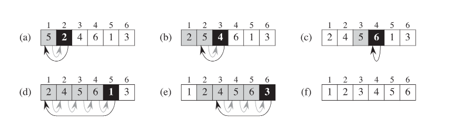

摘要:非正式地讲,算法是任何公认的计算程序,它以一些数值或一组数值作为输入,在一定的时间内产生一些数值或一组数值作为输出.因此,一个算法是一连串的计算步骤.因此,算法是将输入转化为输出的一系列计算步骤.你也可以把算法看作是解决一个精心设计的计算问题的工具.问题的陈述以一般条款(term)规定了问题实例所需的输入/输出关系,通常是任意大的输入.算法描述了一个特定的计算程序,用于实现所有实例的输入/输出关系. 进而完成所有问题的输入/输出关系.

<!-- more -->

<!-- toc -->

## 1.1 算法

举个例子,假设你需要将一串数字按单调递增的顺序排序.这个问题在实践中经常出现,并提供了许多标准设计技术和为分析工具提供了肥沃的土壤(提供了很多理论时间机会).下面是我们如何正式确定排序问题的.
Input: A sequence of n numbers (a1,a2....ani)
Output:一个输入序列的排列组合（重新排序）(a1',a2'....an'),即(a1'小于 a2' 小于 ...an')(这表示排序的意思,是一种广义定义)

例如，鉴于输入序列(31; 41; 59; 26; 41; 58i)一个排序算法返回序列(26; 31; 41; 41; 58; 59)作为输出。这样一个输入序列被称为被称为排序问题的一个实例。一般来说，一个问题的实例
包括计算解决方案所需的输入（满足问题陈述中的任何约束条件语句），以计算出该问题的解决方案。

因为许多程序将其作为中间步骤，所以排序是计算机科学的一个基本操作。在计算机科学中的基本操作。因此，我们有大量的好的分拣算法供我们使用。哪种算法最适合给定的应用取决于除其他因素外，还要看需要排序的项目的数量，项目已被排序的程度。项目已经有了一定程度的分类，对项目价值的可能限制。计算机的结构，以及要使用的存储设备的种类：主存储器、磁盘，甚至是磁带。存储器、磁盘或甚至磁带。

如果对于每一个输入实例，它都以正确的输出停止，那么就可以说该算法是正确的。正确的输出。我们说，一个正确的算法解决了给定的计算问题。一个不正确的算法可能在某些输入实例上根本就没有停止，或者它可能以一个不正确的答案停止。也可能以一个不正确的答案停止。与你可能期望的相反，不正确的算法有时是有用的，如果我们能够控制其错误率的话。我们将看到我们将在第31章中看到一个错误率可控的算法的例子。研究发现大素数的算法。然而，通常情况下，我们将只关注正确的算法。

算法可以用英语来描述，也可以是计算机程序，甚至是硬件设计。唯一的要求是，规格化必须提供一个准确描述要遵循的计算程序。

**什么类型的问题是由算法解决的？**

已知的问题中，排序并不仅仅是一个计算问题(你可以能非常怀疑当你看到这本书的时候)。算法的实际应用无处不在，包括以下几个例子的例子.

- 人类基因工程已经取得重大进展，其目标是识别人类 DNA 中的所有 10 万个基因，确定构成人类 DNA的30 亿个化学基对的序列，在数据库中存储这类信息并为数据分析开发工具。这些工作都需要复杂的算法。虽然对涉及的各种问题的求解超出了本书的范围但是求解这些生物问题的许多方法采用了本书多章内容的思想，从而使得科学家能够有效地使用资源以完成任务。因为可以从实验技术中提取更多的信息，所以既能节省人和机器的时间又能节省金钱
- 互联网使得全世界的人都能快速地访问与检索大量信息。借助于一些聪明的算法，互联网上的网站能够管理和处理这些海量数据。必须使用算法的问题示例包括为数据传输寻找好的路由(求解这些问题的技术在第 24 章给出)，使用一个搜索引来快速地找到特定信息所在的网页
- 电子商务使得货物与服务能够以电子方式洽谈与交换，并且它依赖于像信用卡号、密码和银行结单这类个人信息的保密性。电子商务中使用的核心技术包括(第 31 章中包含的)公钥密码与数字签名，它们以数值算法和数论为基础。
- 制造业和其他商务企业常常需要按最有益的方式来分配稀有资源。一家石油公司也许希望知道在什么地方设置其油井，以便最大化其预期的利润。一位政治候选人也许想确定在什么地方花钱购买竟选广告，以便最大化赢得竞选的机会。一家航空公司也许希望按尽可能最廉价的方式把乘务员分配到班机上，以确保每个航班被覆盖并且满足政府有关乘务员调度的法规。一个互联网服务提供商也许希望确定在什么地方放置附加的资源以便更有效地服务其顾客。所有这些都是可以用线性规划来求解的问题的例子，我们将在第 29 章学习这种技术。


虽然这些例子的一些细节已超出本书的范围，但是我们确实说明了一些适用于这些问题和问题领域的基本技术。我们还说明如何求解许多具体问题，包括以下问题:

- 给定一张交通图，上面标记了每对相邻十字路口之间的距离，我们希望确定从一个十字路口到另一个十字路口的最短道路。即使不允许穿过自身的道路，可能路线的数量也会很大。在所有可能路线中，我们如何选择哪一条是最短的?这里首先把交通图(它本身就是实际道路的一个模型建模为一个图(第六部分和附录 B将涉及这个概念)，然后寻找图中从一个顶点到另一个顶点的最短路径。第 24 章将介绍如何有效地求解这个问题，
- 给定两个有序的符号序列 X=(21，t，·，Xm)和Y=(yi，Y，·，Y.)，求出X和Y的最长公共子序列。X 的子序列就是去掉一些元素(可能是所有，也可能一个没有)后的X。例如，(A，B，C，D，E，F，G)的一个子序列是(B，C，E，G)。X和Y的最长公共子序列的长度度量了这两个序列的相似程序。例如，若两个序列是 DNA 链中的基对则当它们具有长的公共子序列时我们认为它们是相似的。若X有m 个符号Y有n个符号，则X和Y分别有 2的m次幂和2的n次幂个可能的子序列。除非 m和n很小，否则选择X和Y的所有可能子序列做匹配将花费使人望而却步多的时间。第 15 章将介绍如何使用一种称为动态规划的一般技术来有效地求解这个问题。
- 给定一个依据部件库的机械设计，其中每个部件可能包含其他部件的实例，我们需要依次列出这些部件，以使每个部件出现在使用它的任何部件之前。若该设计由 n 个部件组成，则存在 n!种可能的顺序，其中 n!表示阶乘函数。因为阶乘函数甚至比指数函数增长还快，(除非我们只有几个部件，否则)先生成每种可能的顺序再验证按该顺序每个部件出现在使用它的部件之前，是不可行的。这个问题是拓扑排序的一个实例，第 22 章将介绍如何有效地求解这个问题。
- 给定平面上的n个点，我们希望寻找这些点的凸壳。凸壳就是包含这些点的最小的凸多边形。直观上，我们可以把每个点看成由从一块木板钉出的一颗钉子来表示。凸壳则由一根拉紧的环绕所有钉子的橡皮筋来表示。如果橡皮筋因绕过某颗钉子而转弯，那么这颗钉子就是凸壳的一个顶点(例子参见图 33-6)n个点的2的n次幂个子集中的任何一个都可能是凸壳的顶点集。仅知道哪些点是凸壳的顶点还很不够，因为我们还必须知道它们出现的顺序。所以为求凸壳的顶点，存在许多选择。第 33 章将给出两种用于求凸壳的好方法。

虽然这些问题的列表还远未穷尽(也许你已经再次从本书的重量推测到这一点)，但是它们却展示了许多有趣的算法问题所共有的两个特征:

1. 存在许多候选解，但绝大多数候选解都没有解决手头的问题。寻找一个真正的解或一个最好的解可能是一个很大的挑战。
2. 存在实际应用。在上面所列的问题中，最短路径问题提供了最易懂的例子。一家运输公司(如公路运输或铁路运输公司)对如何在公路或铁路网中找出最短路径，有着经济方面的利益因为采用的路径越短，其人力和燃料的开销就越低。互联网上的一个路由结点为了快速地发送一条消息可能需要寻找通过网络的最短路径。希望从纽约开车去波士顿的人可能想从一个恰当的网站寻找开车方向，或者开车时她可能使用其GPS.

算法解决的每个问题并不都有一个容易识别的候选解集。例如，假设给定一组表示信号样本的数值，我们想计算这些样本的离散傅里叶变换。离散傅里叶变换把时域转变为频域，产生一组数值系数，使得我们能够判定被采样信号中各种频率的强度。除了处于信号处理的中心之外，离散傅里叶变换还应用于数据压缩和大多项式与整数相乘。第 30 章为该问题给出了个有效的算法一一快速傅里叶变换(通常称为 FFT)，并且这章还概述了计算 FFT 的硬件电路的设计

**数据结构**
本书也包含几种数据结构。数据结构是一种存储和组织数据的方式，旨在便于访问和修改，没有一种单一的数据结构对所有用途均有效，所以重要的是知道几种数据结构的优势和局限
**技术**
虽然可以把本书当做一本有关算法的"菜谱"来使用，但是许在某一天你会到一个问题-时无法很快找到一个已有的算法来解决它(例如本书中的许多练习和思考题就是这样的情况)本书将教你一些算法设计与分析的技术，以便你能自行设计算法、证明其正确性和理解其效率不同的章介绍算法问题求解的不同方面。有些章处理特定的问题，例如，第 9 章的求中位数和顺序统计量，第 23 章的计算最小生成树，第 26 章的确定网络中的最大流，其他章个绍一些技术例如第 4 章的分治策略，第 15 章的动态规划，第 17 章的摊还分析

**难题**
本书大部分讨论有效算法，我们关于效率的一般量度是速度，即一个算法花多长时间产生结果。然而有一些问题，目前还不知道有效的解法。第 34 章研究这些问题的一个有趣的子集其中的问题被称为 NP 完全的.
为什么NP 完全问题有趣呢?第一，虽然迄今为止不曾找到对一个 NP 完全问题的有效算法，但是也没有人能证明 NP 完全问题确实不存在有效算法。换句话说，对于 NP 完全问题，是否存在有效算法是未知的。第二，NP 完全问题集具有一个非凡的性质:如果任何一个 NP 完全问题存在有效算法，那么所有 NP 完全问题都存在有效算法。NP 完全问题之间的这种关系使得有效解的缺乏更加诱人。第三，有几个 NP 完全问题类似于(但又不完全同于)一些有着已知有效算法的问题。计算机科学家迷恋于如何通过对问题陈述的一个小小的改变来很大地改变其已知最佳算法的效率。
你应该了解 NP 完全问题，因为有些 NP 完全问题会时不时地在实际应用中冒出来。如果要求你找出某一NP 完全问题的有效算法，那么你可能花费许多时间在毫无结果的探寻中。如果你能证明这个问题是 NP 完全的，那么你可以把时间花在开发一个有效的算法，该算法给出一个好的解，但不一定是最好的可能解.
作为一个具体的例子，考虑一家具有一个中心仓库的投递公司。每天在中心仓库为每辆投递车装货并发送出去，以将货物投递到几个地址。每天结束时每辆货车必须最终回到仓库，以便准备好为第二天装货。为了减少成本，公司希望选择投递站的一个序，按此序产生每辆货车行驶的最短总距离。这个问题就是著名的“旅行商问题”，并且它是 NP 完全的。它没有已知的有效算法。然而，在某些假设条件下，我们知道一些有效算法，它们给出一个离最小可能解不太远的总距离

**并行性**
我们或许可以指望处理器时钟速度能以某个持续的比率增加多年。然而物理的限制对不断提高的时钟速度给出了一个基本的路障:因为功率密度随时钟速度超线性地增加，一旦时钟速度变得足够快，芯片将有熔化的危险。所以，为了每秒执行更多计算，芯片被设计成包含不止一个而是几个处理“核”。我们可以把这些多核计算机比拟为在单一芯片上的几台顺序计算机;换句话说，它们是一类“并行计算机”。为了从多核计算机获得最佳的性能，设计算法时必须考虑并行性。第 27 章给出了充分利用多核的“多线程”算法的一个模型。从理论的角度来看，该模型具有一些优点，它形成了几个成功的计算机程序的基础，包括一个国际象棋博弈程序  
Exercises  
1.1-1 Give a real-world example that requires sorting or a real-world example that requires computing a convex hull([数]凸包).  
   - Sorting: browse the price of the restaurants with ascending prices on NTU street.
   - Convex hull: computing the diameter of set of points.  

1.1-2 Other than speed, what other measures of efficiency might one use in a real-world setting?  
   - Memory efficiency and coding efficiency.  

1.1-3 Select a data structure that you have seen previously, and discuss its strengths and limitations.  
   - Linked-list:
     - Strengths: insertion and deletion.
     - Limitations: random access.  

1.1-4 How are the shortest-path and traveling-salesman problems given above similar? How are they different?  
   - Similar: finding path with shortest distance.
   - Different: traveling-salesman has more constraints.  

1.1-5 Come up with a real-world problem in which only the best solution will do. Then come up with one in which a solution that is "approximately" the best is good enough.

summary:

1. 算法的好坏，例如排序算法，取决于需要排序的项目的数量，项目已被排序的程度
2. 算法两个特征
   1. 存在许多候选解，但绝大多数候选解都没有解决手头的问题。寻找一个真正的解或一个最好的解可能是一个很大的挑战
   2. 有很多实际问题需要算法来解决，算法可以解决生活中大多数问题，比如求最短路径和最大收益
3. 算法导论更像是菜谱
4. 关于效率的一般参考标准是速度，即一个算法花多长时间产生结果。然而有一些问题，目前还不知道有效的解法
5. 算法能影响或者说是提高我们的收益

## 1.2 作为一种技术的算法

Suppose computers were infinitely fast and computer memory was free. Would you have any reason to study algorithms? The answer is yes, if for no other reason than that you would still like to demonstrate that your solution method terminates and does so with the correct answer. If computers were infinitely fast, any correct method for solving a problem would do. You would probably want your implementation to be within the bounds of good software engineering practice (for example, your implementation should be well designed and documented), but you would most often use whichever method was the easiest to implement. Of course, computers may be fast, but they are not infinitely fast. And memory may be inexpensive, but it is not free. Computing time is therefore a bounded resource, and so is space in memory. You should use these resources wisely(adv. 明智地；聪明地), and
algorithms that are efficient in terms of `time` or `space` will help you do so.


**Efficiency**

Different algorithms devised(设计) to solve the same problem often differ dramatically in their efficiency. These differences can be much more significant than differences due to hardware and software.(为解决同一问题而设计的不同算法在效率上往往有很大的不同。这种效率差异可能比硬件和软件的带来的效率差异要大得多)
As an example, in Chapter 2, we will see two algorithms for sorting. The first,known as insertion sort, takes time roughly equal to $c_1n^2$ to sort $n$ items,where $c_1$ is a constant that does not depend on $n$,That is, it takes time roughly proportional(adj. 比例的，成比例的) to $n^2$,. The second, `merge sort`, takes time roughly equal to $c_2nlgn$,where $lgn$ stands for $log_2n$ and $c_2$ is another constant that also does not depend on $n$. Insertion sort typically has a smaller constant factor than merge sort, so that c1 < c2.We shall see that the constant factors can have far less of an impact on the running time than the dependence on the input size $n$.Let’s write insertion sort’s running time as $c_1n$ n and merge sort’s running time as $c_2nlgn$,Then we see that where insertion sort has a factor of $n$ in its running time, merge sort has a factor of $lgn$ which is much smaller(For example, when n = 1000, $lgn$ is approximately 10, and when $n$ equals one million(n. 百万), $lgn$ is approximately only 20.)Although insertion sort usually runs faster than merge sort for small input sizes, once the input size $n$ becomes large enough, merge sort’s advantage of $lgn$ vs. $n$ will more than compensate(vi. 补偿，赔偿) for the difference in constant factors. No matter how much smaller $c_1$ is than $c_2$, there will always be a crossover point beyond which merge sort is faster.

For a concrete example, let us pit a faster computer (computer A) running insertion sort against a slower computer (computer B) running merge sort. They each
must sort an array of 10 million numbers. (Although 10 million numbers might seem like a lot, if the numbers are eight-byte integers, then the input occupies about 80 megabytes, which fits in the memory of even an inexpensive laptop com-puter many times over.) Suppose that computer A executes 10 billion(n.十亿) instructions per second (faster than any single sequential computer at the time of this writing) and computer B executes only 10 million instructions per second, so that computer A is 1000 times faster than computer B in raw computing power. To make the difference even more dramatic, suppose that the world’s craftiest programmer codes insertion sort in machine language for computer A, and the resulting code requires $2n^2$ instructions to sort $n$ numbers. Suppose further that just an average programmer implements merge sort, using a high-level language with an inefficient compiler, with the resulting code taking $50nlgn$ instructions. To sort 10 million numbers, computer A takes  
$\frac{2*(10)^2 instructions}{10^{10} instruction/second }$   
while computer B takes  
$\frac{50*10^7*lg10^7 instructions}{10^{7} instruction/second }$  
By using an algorithm whose running time grows more slowly, even with a poor compiler, computer B runs more than 17 times faster than computer A! The advantage of merge sort is even more pronounced when we sort 100 million numbers:where insertion sort takes more than 23 days, merge sort takes under four hours.In general, as the problem size increases, so does the relative advantage of mergesort.

summary:
1. insertion sort at low input data, the performance is better than merge sort. but at big level input , there is performance gap.


## 1.3 Algorithms and other technologies

The example above shows that we should consider algorithms, like computer hardware, as a technology. Total system performance depends on choosing efficient algorithms as much as on choosing fast hardware. Just as rapid advances are being made in other computer technologies, they are being made in algorithms as well. You might wonder whether algorithms are truly that important on contemporary computers in light of other advanced technologies(鉴于其他先进技术，算法在当代计算机上是否真的那么重要？), such as

- advanced computer architectures and fabrication technologies(制造)
- easy-to-use, intuitive(直观的), graphical user interfaces (GUIs)
- object-oriented systems
- integrated Web technologies, and
- fast networking, both wired and wireless

The answer is yes. Although some applications do not explicitly require algorithmic content at the application level (such as some simple, Web-based applications),
many do. For example, consider a Web-based service that determines how to travel from one location to another. Its implementation would rely on fast hardware, a graphical user interface, wide-area networking, and also possibly on object orientation. However, it would also require algorithms for certain operations, such as finding routes (probably using a shortest-path algorithm), rendering maps, and interpolating addresses.

Moreover, even an application that does not require algorithmic content at the application level relies heavily upon algorithms. Does the application rely on fast
hardware? The hardware design used algorithms. Does the application rely on graphical user interfaces? The design of any GUI relies on algorithms. Does the
application rely on networking? Routing in networks relies heavily on algorithms. Was the application written in a language other than machine code? Then it was
processed by a compiler, interpreter, or assembler, all of which make extensive use of algorithms. Algorithms are at the core of most technologies used in contempo-
rary computers.

Furthermore, with the ever-increasing capacities of computers, we use them to solve larger problems than ever before. As we saw in the above comparison be-
tween insertion sort and merge sort, it is at larger problem sizes that the differences in efficiency between algorithms become particularly prominent.
**Having a solid base of algorithmic knowledge and technique is one characteristic that separates the truly skilled programmers from the novices(n.新手初学者). With modern com-
puting technology, you can accomplish some tasks without knowing much about algorithms, but with a good background in algorithms, you can do much, much more**

summary:
1. web-based application transfer file to another do not need Algorithms, but finding routes,rendering maps,interpolating addresses need Algorithms
2. application donot need algorithm,but
   1. fast-hardware
   2. The design of any GUI relies on algorithms
   3. Routing in networks relies heavily on algorithms
   4. compiler, interpreter, or assembler need algorithm
   5. Algorithms are at the core of most technologies used in contemporary computers.
3. 卧槽，最后一段的presentation实在是太牛逼了-这不得建议全文背诵

Exercises  
1.2-1 Give an example of an application that requires algorithmic content at the application level, and discuss the function of the algorithms involved.

- Drive navigation

1.2-2 Suppose we are comparing implementations of insertion sort and merge sort on the same machine. For inputs of size n, insertion sort runs in $8n^2$ steps, while merge sort runs in $64nlgn$ steps. For which values of n does insertion sort beat merge sort?

- $8n^2$<$64nlgn$


1.2-3 What is the smallest value of n such that an algorithm whose running time is $100n^2$ runs faster than an algorithm whose running time is $2^n$ on the same machine?

- $100n^2$ < $2^n$ , the result n is minimum value, n>=15


## 2.1 插入排序

Our first algorithm, insertion sort, solves the sorting problem introduced in Chapter 1:


**Input**: A sequence of n numbers ( $a_1; a_2;.... a_n$ ).
**Output**: A permutation(n.[数]排列) (reordering) $a^1_1; a^1_2$....) of the input sequence such that $a^1_1$<$a^1_2$...
The numbers that we wish to sort are also known as the keys. Although conceptually(adv.概念地) we are sorting a sequence, the input comes to us in the form of an array with n elements.In this book, we shall typically describe algorithms as programs written in a pseudocode(美 [ˈsju:doˌkod]) that is similar in many respects to C, C++, Java, Python, or Pascal. If you have been introduced to any of these languages, you should have little trouble 

**Figure 2.1** Sorting a hand of cards using insertion sort.

插入排序有点像我们抓拍时候的场景，一个手拿牌并不断的按照顺序将手里的牌排序。



**Figure 2.2** The operation of INSERTION-SORT on the array A = (5; 2; 4; 6; 1; 3). Array indices(n. 指数目录) appear above the rectangles, and values stored in the array positions appear within the rectangles.(a)–(e) The iterations of the for loop of lines 1–8. In each iteration, the black rectangle holds thekey taken from A(j) , which is compared with the values in shaded rectangles to its left in the test of line 5. Shaded arrows show array values moved one position to the right in line 6, and black arrows indicate where the key moves to in line 8. (f) The final sorted array.

## 2.2 迭代不变量和插入排序的正确性

what is In fact,elements A[1...j-1] are the elements originally in positions 1 through j 1, but now in sorted order. We state these properties of A[1...j-1] formally as a **loop invariant**: At the start of each iteration of the for loop of lines 1–8, the subarray A[1...j-1] consists of the elements originally in A[1...j-1] , but in sorted order.

Initialization: It is true prior to the first iteration of the loop.
Maintenance: If it is true before an iteration of the loop, it remains true before the
next iteration. Termination: When the loop terminates, the invariant gives us a useful property that helps show that the algorithm is correct.

三属性的解释  
**Initialization**: We start by showing that the loop invariant holds before the first
loop iteration, when j = 2. The subarray A[1...j-1] , therefore, consists
of just the single element A[1] , which is in fact the original element in A[1]
Moreover, this subarray is sorted (trivially, of course), which shows that the
loop invariant holds prior to the first iteration of the loop.

**Maintenance**: Next, we tackle the second property: showing that each iteration
maintains the loop invariant. Informally, the body of the for loop works by
moving A[j-1] , A[j-2] , A[j-3] , and so on by one position to the right
until it finds the proper position for AŒj (lines 4–7), at which point it inserts
the value of AŒj (line 8). The subarray A[1...j-1] then consists of the elements
originally in A[1...j-1] , but in sorted order. Incrementing j for the next iteration
of the for loop then preserves the loop invariant.A more formal treatment of the second property would require us to state and
show a loop invariant for the while loop of lines 5–7. At this point, however,we prefer not to get bogged down in such formalism, and so we rely on our
informal analysis to show that the second property holds for the outer loop.

**Termination**: Finally, we examine what happens when the loop terminates. The
condition causing the for loop to terminate is that j > A.length=n. Because
each loop iteration increases j by 1, we must have j=n+1 at that time.
Substituting n+1 for j in the wording of loop invariant, we have that the
subarray A[1...n] consists of the elements originally in A[1...n] , but in sorted
order. Observing that the subarray A[1...n] is the entire array, we conclude that
the entire array is sorted. Hence, the algorithm is correct.

这章节还规定了伪代码规范，适用于以后所有章节

```golang
package algorithm
import "fmt"
var cards = []int{7, 6, 5, 4, 3, 2, 1}
/*
插入排序
*/
func insertSort() {
	for i := 1; i < len(cards); i++ {
		kingValue := cards[i]
		for j := i - 1; j >= 0; j-- {
			if kingValue < cards[j] {
				cards[j+1] = cards[j]
				cards[j] = kingValue
			}
		}

	}
	fmt.Println(cards)
}

```


## 15.动态规划

简单讲跟分治方法很像,但是分治是将将问题分解然后一个一个解决,但是动态规划是找子问题重叠的情况,既不同的子问题有公共的子问题,及将子问题求解一遍再将其保存到表格中.传统的递归时间复杂度会有2的N次幂,而用DP改写就会有N的2次幂

<!-- more -->

### 15.1 钢条切割

一个钢条,按照不同长度切割可以卖出不同价格
| length | 1    | 2    | 3    | 4    | 5    | 6    | 7    | 8    | 9    |
| ------ | ---- | ---- | ---- | ---- | ---- | ---- | ---- | ---- | ---- |
| price  | 1    | 5    | 8    | 9    | 10   | 17   | 17   | 20   | 30   |

1. 传统递归
其实是尝试遍了所有的可能性.所以开销很大

就如上图,每一个分治就是一种可能

2. 自底向上的动态规划

```cpp
// Cut-Rod with bottom-up method
int BottomUpCutRod(const std::vector<int> &p, const int &n)
{
    std::vector<int> r{0};
    for (auto j = 1; j <= n; ++j)
    {
        int q = INT8_MIN;
        for (auto i = 1; i <= j; ++i)
        {
            q = std::max(q, p.at(i) + r.at(j - i));
        }
        r.push_back(q);
    }
    return r.at(n);
}
```

### 15.2 最大子序和

这道题是来自leetcode.给你一个整数数组 nums,请你找出一个具有最大和的连续子数组（子数组最少包含一个元素）,返回其最大和.子数组 是数组中的一个连续部分.


```golang
 // {-2, 1, -3, 4, -1, 2, 1, -5, 4}
func maxSubArray(nums []int) int {


 if len(nums) == 0 {
  return 0
 }
 res := -32768
 f_n := -1

 for i := 0; i < len(nums); i++ {
  f_n = Max(nums[i], f_n+nums[i])
  res = Max(f_n, res)
 }
 return res
}

func Max(a int, b int) int {

 if a >= b {
  return a
 }
 return b
}
```

这里主要是使用了**kadane**算法,使用一个变量跟踪最大值,f_n = Max(nums[i], f_n+nums[i])是kadane的核心思想,如果我下个位置的数字大于你们前面的和,说明前面的结果就不是最大整数和